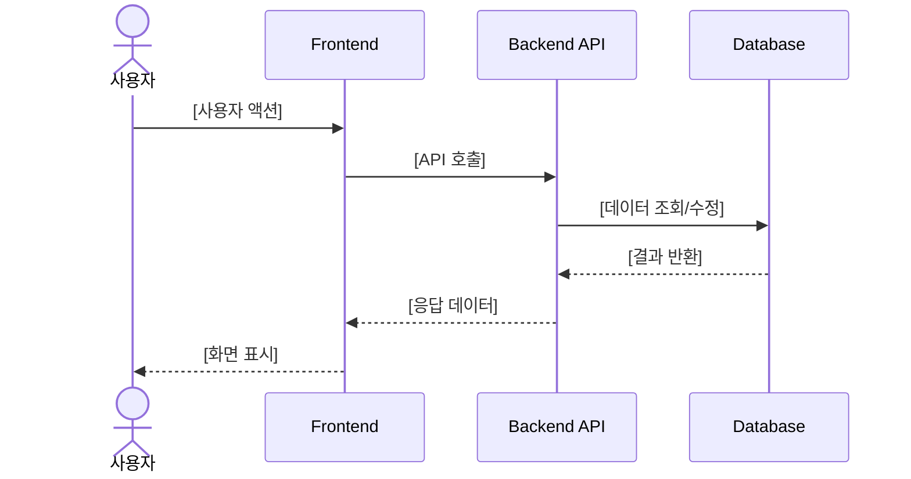
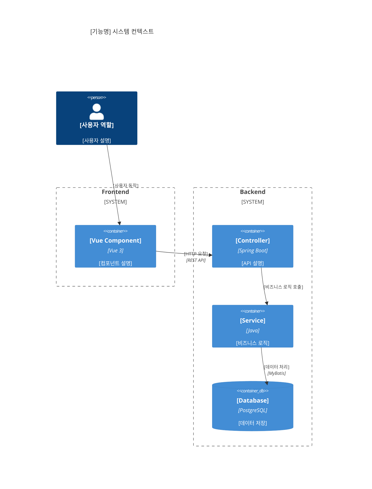

# Task 정의서 작성 프롬프트

**⚠️ 요구사항 문서 미 첨부시 작업을 중단하고 사용자에게 첨부요청, 첨부된 파일은 누락없이 모두 파악**

> [!CRITICAL]
> **Role**: Senior Product Manager & Application Architecture Expert & Web Designer
> **Goal**: 요구사항정의서를 기반으로 **AI 개발자가 즉시 개발을 시작할 수 있는 구체적이고 명확한 Task 정의서**를 작성한다.
> **Constraint**: 실제 개발 코드 작성이나 개발 작업 수행 금지. **Task 정의서 작성에만 집중**한다.

## 프로젝트 설정 (필수 질의)

**⚠️ 프롬프트 실행 전 반드시 사용자에게 다음 정보를 질의하여 확인하세요:**

> **중요**: 이 프롬프트는 다양한 프로젝트에서 재사용 가능하도록 설계되었습니다. 프로젝트별 설정 정보를 사용자로부터 반드시 확인한 후 변수를 치환하여 사용하세요.
> 
> **⚠️ 질의 응답을 받을 때까지 작업을 진행하지 마세요. 사용자의 응답을 받은 후에만 다음 단계로 진행하세요.**

**질의 항목**:

1. **시스템명 (파일명 헤더)**: Task 정의서 파일명의 헤더 부분에 사용될 시스템명
   - 예: "wms"
   - 형식: 소문자, 하이픈(-) 사용 가능, 특수문자 없음
   - 변수: `{SYSTEM_NAME}`
   - 설명: 파일명 규칙 `{SYSTEM_NAME}-{{3digitSeqNum}}.{{ 1depthMenuName }}-{{ 2depthMenuName }}-{{ 3depthMenuName }}.task.md`에서 사용 ({{ 3depthMenuName }}은 선택사항)

2. **시스템 전체명**: 시스템의 전체 이름 (Task 정의서 헤더에 사용)
   - 예: "WMS 창고관리시스템"
   - 변수: `{SYSTEM_FULL_NAME}`

**질의 예시**:
```
프로젝트 설정 정보를 확인합니다:
- 시스템명 (파일명 헤더): [사용자 입력] (예: wms)
- 시스템 전체명: [사용자 입력] (예: WMS 창고관리시스템)
```

**변수 치환 및 사용 규칙**:
- 사용자로부터 입력받은 값을 프롬프트 내 모든 `{변수명}` 위치에 치환
- `{SYSTEM_NAME}`: 파일명 헤더에 사용 (예: "wms")
  - 형식: 소문자, 하이픈(-) 사용 가능, 특수문자 없음
  - 파일명 규칙: `{SYSTEM_NAME}-{{3digitSeqNum}}.{{ 1depthMenuName }}-{{ 2depthMenuName }}-{{ 3depthMenuName }}.task.md` ({{ 3depthMenuName }}은 선택사항)
- `{SYSTEM_FULL_NAME}`: Task 정의서 헤더의 "시스템" 필드에 사용 (예: "WMS 창고관리시스템")

---

> [!CRITICAL]
> **시스템**: {SYSTEM_FULL_NAME}
> **파일명 규칙**: `{SYSTEM_NAME}-{{3digitSeqNum}}.{{ 1depthMenuName }}-{{ 2depthMenuName }}-{{ 3depthMenuName }}.task.md`
>   - {{ 1depthMenuName }}: 요구사항의 구조를 파악하여 1Depth 메뉴명을 한국어로 정의 (예: 사용자관리)
>   - {{ 2depthMenuName }}: 요구사항의 구조를 파악하여 2Depth 메뉴명을 한국어로 정의 (예: 회원가입인증)
>   - {{ 3depthMenuName }}: 요구사항의 구조를 파악하여 3Depth 메뉴명을 한국어로 정의 (optional)
>   - {{ 3digitSeqNum }}: 먼저 만들어진 파일명의 패턴을 파악하여 순번을 채번 (예: 001, 002, 003)

## 필수 작업 계획 수립

- 다음 **3단계**로 작업을 분할하여 계획 수립, 파일에 기록되지 않는 단계별 작업 결과는 최대로 요약해서 표시(LLM 사용료 절약), 각 Task 는 사용자가 확인 후 실행(자동 실행 금지)

1. 시스템 개발 가이드라인 숙지
2. Task 정의서 작성
3. Task 정의서 검증

## 실행 프로세스

### 1단계: 데이터 모델 및 기술 스택 파악(Critical)
**목표**: Task 정의서 작성에 필요한 데이터 모델 구조와 기술 스택 정보 파악

**수행 방법**:
1. **데이터 모델 분석** (필수)
   - **스키마 구조 파악**:
     - `database/schemas/*.sql` 파일 중 스키마 생성 관련 파일(`create_schema*.sql` 등)을 참조하여 데이터베이스 스키마 생성 및 구조 파악
   - **권한 구조 파악**:
     - `database/schemas/*.sql` 파일 중 권한 관련 파일(`*role*.sql`, `*user*.sql`, `*permission*.sql`, `grant*.sql` 등)을 참조하여 역할(Role), 사용자(User), 권한 부여 구조 파악
   - **테이블 구조 및 관계 파악** (모든 테이블 생성 파일 참조):
     - `database/schemas/*.sql` 파일 중 테이블 생성 관련 파일(`create_tables*.sql`, `create_table*.sql` 등)을 모두 참조하여 테이블 구조와 관계 파악
     - 파일명 패턴 예시: `create_tables_phase*.sql`, `create_table_*.sql` 등
     - 각 Phase 파일은 기능 도메인별로 테이블을 구성하므로, 파일명과 내용을 분석하여 도메인별 데이터 모델 이해
   - **목적**: 
     - Task 정의서의 ERD 다이어그램 작성 시 전체 데이터베이스 구조 파악
     - 기존 테이블 및 관계 활용 여부 판단
     - 스키마 및 권한 구조를 고려한 데이터 모델 설계
     - Phase별/도메인별 테이블 구조를 통한 기능 도메인별 데이터 모델 이해

2. **기술 스택 정보 파악** (필수)
   - `.cursor/.rules/project.common.instructions.mdc`: 기술 스택 및 기본 규칙 참조
   - 확인 항목:
     - 기술 스택: Vue 3, Spring Boot, PostgreSQL, MyBatis 등
     - 기본 규칙: Map<String, Object> 사용, Response 형식 등
   - 목적: Task 정의서의 시스템 아키텍처 및 API 설계 섹션 작성

### 2단계: Task 정의서 작성(Core)
**목표**: 사전 분석과 추가 요구사항 수집으로 완성된 요구사항 정의서를 기반으로 AI로 개발 가능한 Task 정의서 생성
**Task 정의서 파일 저장**: 아래 `Task 정의서 출력 형식 (표준)` 양식대로 작성하여 `docs/02.design/01.tasks/{SYSTEM_NAME}-{{3digitSeqNum}}.{{ 1depthMenuName }}-{{ 2depthMenuName }}-{{ 3depthMenuName }}.task.md` 파일에 저장
**요구사항정의서 준수**: 입력으로 제공된 요구사항정의서 내용 완전 반영

#### Task 정의서 작성 핵심 원칙 (바이브 코딩)

**작성 원칙**
- **구조화**: `1. → 1.1 → 1.1.1` 명확한 계층 구조
- **완결성**: 각 섹션 독립적 이해 가능
- **시각화**: 복잡한 로직은 Mermaid Diagram 필수
- **사용자 중심**: User Story 관점 기술
- **기술 명세**: API/데이터 모델 완전 정의

**철학**: 엄격한 규칙보다는 **핵심 원칙과 아키텍처 일관성** 유지
- Why → What → How 구조
  - **Why**: 비즈니스 목표와 필요성
  - **What**: 사용자 스토리와 인수 조건
  - **How**: 기술적 가이드라인과 구현 방향

- Convention over Configuration
  - 프로젝트 기술 스택과 디자인 시스템 **100% 준수**
  - 개발자의 **핵심 로직 집중** 지원

- Pattern & Consistency
  - **우선순위**: 기존 코드베이스 패턴 최우선 준수
  - **새 패턴**: 명확한 이유와 적용 범위 문서화

- Simplicity & Clarity
  - **기본**: 가장 단순하고 명확한 해결책
  - **복잡성**: 필요시에만 도입, 이해하기 쉬운 문서화

### 3단계: Task 정의서 검증(Critical)
**목표**: 작성된 Task 정의서의 완성도와 요구사항 반영 여부 최종 검증

**검증 절차**:
1. 템플릿의 "5. 검증 체크리스트" 섹션의 모든 항목 확인
2. 요구사항정의서를 다시 읽고 내용이 누락없이 모두 반영되었는지 확인
3. 누락된 요구사항이나 불명확한 부분 발견시 Task 정의서 보완

---

## Task 정의서 출력 형식 (표준)

> **⚠️ 중요**: 아래 템플릿을 정확히 준수하여 작성. 특별한 경우가 아니면 이 템플릿 외의 섹션 추가 금지.

## Task 정의서 템플릿

> **⚠️ 생성일자 기준**: 실제 문서가 생성된 날짜를 사용합니다. 시스템 날짜를 확인하여 YYYY-MM-DD 형식으로 입력하세요. (예: `date +"%Y-%m-%d"` 명령어로 확인 가능)

```
# [기능명]

**문서 버전**: v1.0
**생성일자**: [실제 문서 생성 날짜를 YYYY-MM-DD 형식으로 입력. 예: 2025-11-25]
**담당자**: [담당자]
**시스템**: {SYSTEM_FULL_NAME}
**메뉴 경로**: [1depthMenuName] > [2depthMenuName] > [3depthMenuName]

---

## 1. 개요
### 1.1 목적
[이 기능을 구현하는 비즈니스 목표와 필요성을 명확하게 기술]

### 1.2 범위
- [이 기능의 구현 범위와 제외 사항을 명확하게 기술]

---

## 2. 사용자 스토리 및 기능 명세

### 2.1 요구사항
> ⚠️ 한글이나 특수문자는 큰따옴표(")로 감싸야 오류가 발생하지 않음

```mermaid
requirementDiagram

    requirement "[요구사항명]" {
        id: "[요구사항ID]"
        text: "[요구사항 설명]"
        risk: [low|medium|high]
        verifymethod: [inspection|test|analysis|demonstration]
    }

    element "[시스템/모듈명]" {
        type: [system|subsystem|component]
        docref: "[문서참조경로]"
    }

    [요구사항명] - satisfies -> [시스템/모듈명]
```

### 2.2 관련 요구사항 (선택사항)
> 관련 RFP 요구사항이 있는 경우에만 추가

- [요구사항ID]: [요구사항명](RFP파일경로)

### 2.3 사용자 스토리

**주요 사용자**:
- **[역할1]**: [역할 설명]
- **[역할2]**: [역할 설명]

**스토리**:
1. **[스토리명]**
   - As a [역할], I want to [작업], so that [목표].

### 2.4 인수 조건
- [ ] [검증 가능한 조건 1]
- [ ] [검증 가능한 조건 2]
- [ ] [검증 가능한 조건 3]

### 2.5 기능 워크플로우



---

## 3. 기술 요구사항

### 3.1 시스템 아키텍처



### 3.2 데이터 모델

> **DB Schema**: 
> - **우선순위 1**: `database/schemas/*.sql` 파일 중 테이블 생성 관련 파일(`create_tables*.sql`, `create_table*.sql` 등)에서 기존 테이블 최대한 활용
>   - 파일명 패턴 예시: `create_tables_phase*.sql`, `create_table_*.sql` 등
>   - 각 파일의 내용을 분석하여 포함된 테이블과 도메인 파악
> - **우선순위 2**: 신규 테이블 필요시 해당 기능 도메인에 맞는 기존 파일에 추가하거나 신규 파일 생성
> - **스키마 및 권한 구조**: `database/schemas/*.sql` 파일 중 스키마 생성 파일(`create_schema*.sql` 등)과 권한 관련 파일(`*role*.sql`, `*user*.sql`, `*permission*.sql`, `grant*.sql` 등)을 참조하여 스키마 및 권한 구조 파악

```mermaid
erDiagram
    [TABLE_NAME_1] {
        [DATA_TYPE] [COLUMN_NAME_1] PK "[컬럼 설명]"
        [DATA_TYPE] [COLUMN_NAME_2] "[컬럼 설명]"
    }
    
    [TABLE_NAME_2] {
        [DATA_TYPE] [COLUMN_NAME_1] PK "[컬럼 설명]"
        [DATA_TYPE] [COLUMN_NAME_2] FK "[컬럼 설명]"
    }
    
    [TABLE_NAME_1] ||--o{ [TABLE_NAME_2] : "[관계 설명]"
```

### 3.3 API 설계

> **참고**: 기존 개발된 Back-end/Front-end의 API URL 패턴 우선 사용
> 
> **⚠️ 중요**: 
> - 이 프로젝트는 DTO/VO 클래스를 사용하지 않고 모든 계층에서 `Map<String, Object>`를 사용합니다.
> - Response Body는 반드시 다음 형식을 준수해야 합니다:
>   - `success`: boolean (필수)
>   - `result_code`: String (필수, 예: "I0001" 성공, "E1001"~"E9999" 오류)
>   - `result_message`: String (필수, 한글 메시지)
>   - `data`: Map<String, Object> (선택, 실제 데이터, 조회 API의 경우 필수)
> - Request/Response 예시에서 DTO 클래스명(예: `CreateVehicleDto`, `VehicleDto`)을 사용하지 말고, 실제 필드 구조만 명시하세요.
> - GET 요청의 경우 Response에 `data` 필드가 필수이며, POST/PUT/DELETE의 경우 `data` 필드는 선택사항입니다.

| Method | URL | Description | Request Body | Response Body |
|--------|-----|-------------|--------------|---------------|
| `GET` | `/api/[resource]` | [목록 조회] | - | `Map<String, Object>` (success, result_code, result_message, data 포함) |
| `GET` | `/api/[resource]/{id}` | [상세 조회] | - | `Map<String, Object>` (success, result_code, result_message, data 포함) |
| `POST` | `/api/[resource]` | [신규 등록] | `Map<String, Object>` | `Map<String, Object>` (success, result_code, result_message, data 선택) |
| `PUT` | `/api/[resource]/{id}` | [수정] | `Map<String, Object>` | `Map<String, Object>` (success, result_code, result_message, data 선택) |
| `DELETE` | `/api/[resource]/{id}` | [삭제] | - | `Map<String, Object>` (success, result_code, result_message, data 선택) |

**Request Body 예시**:
```json
{
  "[field1]": "[value]",
  "[field2]": "[value]"
}
```

**Response Body 예시 (GET 요청)**:
```json
{
  "success": true,
  "result_code": "I0001",
  "result_message": "정상적으로 처리되었습니다.",
  "data": {
    "[field1]": "[value]",
    "[field2]": "[value]"
  }
}
```

**Response Body 예시 (POST/PUT/DELETE 요청)**:
```json
{
  "success": true,
  "result_code": "I0001",
  "result_message": "정상적으로 처리되었습니다."
}
```

**Response Body 예시 (에러 응답)**:
```json
{
  "success": false,
  "result_code": "E1001",
  "result_message": "이미 등록된 이메일입니다."
}
```

### 3.4 비즈니스 규칙

#### 3.4.1 데이터 유효성 검증
- **[필드명]**: [검증 규칙 설명]
  - 필수 여부: [필수/선택]
  - 형식: [형식 규칙]
  - 제약 조건: [제약 조건]

#### 3.4.2 권한 및 보안
- **접근 권한**: [권한 레벨 및 제한 사항]
- **데이터 보안**: [보안 처리 방법]

#### 3.4.3 예외 처리 및 에러 핸들링
- **예외 상황 1**: [상황 설명] → "[에러 메시지]" (오류코드: [E0000~E9999])
- **예외 상황 2**: [상황 설명] → "[에러 메시지]" (오류코드: [E0000~E9999])

---

## 4. 개발 계획

### 4.1 전제조건
- 요구사항 및 데이터 모델 확정
- 변경 발생시 담당자 협의 후 진행
- [기타 전제조건]

### 4.2 개발 단계

#### Step 1: 프론트엔드 개발

> **⚠️ 이 Step 실행 전 필수**: 아래 내용대로 작업계획 재수립 필요
> 
> **use plan_task tool** - 다음 **6단계**로 작업을 분할하여 계획 수립, 파일에 기록되지 않는 단계별 작업 결과는 최대로 요약해서 표시(LLM 사용료 절약), 각 Task 는 사용자가 확인 후 실행(자동 실행 금지)
> 
> 1. UI 설계서의 Mock Data 이관
> 2. UI 설계서 html을 프로젝트의 Frontend 구조에 맞게 분할
> 3. 분할된 Frontend 소스코드 연동
> 4. UI 설계서와 Task 정의서의 내용이 잘 반영되었는지 검토 및 보완
> 5. 사용자에게 브라우저 테스트 요청 및 인간과 협업하여 개발 마무리
> 6. 구현된 Frontend 소스코드 파일 목록을 'docs/03.development/{SYSTEM_NAME}-{{3digitSeqNum}}.{{ 1depthMenuName }}-{{ 2depthMenuName }}-{{ 3depthMenuName }}.frontend.dev-result.md' 파일로 저장 ({{ 3depthMenuName }}은 선택사항)

**구현 내용**: (상세코드 작성 금지, 패키지/디렉토리, 클래스/모듈, 메서드 목록, API 목록만 작성)
- **[기능1]**: [구현 설명]
  - 컴포넌트: `[ComponentName].js`
  - 주요 메서드: `[methodName1]()`, `[methodName2]()`
  - 사용 API: `GET /api/[resource]`

**파일 구조**: (Vue 3 CSR, 빌드 시스템 없음)
```
frontend/
├── views/[menu-name]/
│   ├── [Feature]List.js      # 목록 페이지
│   ├── [Feature]Edit.js       # 등록/수정 페이지
│   └── [Feature]Detail.js     # 상세 페이지
├── components/
│   └── [custom]/
│       └── [CustomComponent].js
└── api/v1/
    └── [menu-name].json       # Mock 데이터(백엔드 개발 시 제거)
```

#### Step 2: 백엔드 개발

> **⚠️ 이 Step 실행 전 필수**: 아래 내용대로 작업계획 재수립 필요
> 
> **use plan_task tool** - 다음 **4단계**로 작업을 분할하여 계획 수립
> 
> 1. 'docs/03.development/{SYSTEM_NAME}-{{3digitSeqNum}}.{{ 1depthMenuName }}-{{ 2depthMenuName }}-{{ 3depthMenuName }}.frontend.dev-result.md' 파일의 소스코드를 분석 ({{ 3depthMenuName }}은 선택사항)
> 2. DB 스키마 분석
> 3. Java 소스코드 생성
> 4. 프론트엔드의 API Endpoint 와 해당 로직들이 제대로 구현되었는지 최종 검증

**구현 내용**:
- **Controller**: `[Resource]Controller.java`
  - `GET /api/[resource]` - [기능 설명]
  - `POST /api/[resource]` - [기능 설명]
  
- **Service**: `[Resource]Service.java`
  - `[methodName]()` - [비즈니스 로직 설명]
  
- **Mapper**: `[Resource]Mapper.java` + `[Resource]Mapper.xml`
  - `select[Resource]List()` - [쿼리 설명]
  - `insert[Resource]()` - [쿼리 설명]

**파일 구조**:
```
backend/src/main/
├── java/[BASE_PACKAGE_PATH]/
│   ├── domain/[domain]/
│   │   ├── controller/
│   │   │   └── [Resource]Controller.java
│   │   ├── service/
│   │   │   └── [Resource]Service.java
│   │   └── mapper/
│   │       └── [Resource]Mapper.java
│   └── common/
│       ├── utils/
│       ├── exception/
│       └── controller/
└── resources/
    └── mappers/[domain]/
        └── [Resource]Mapper.xml
```

> **참고**: `[BASE_PACKAGE_PATH]`는 백엔드 개발 프롬프트에서 프로젝트 설정 정보로부터 결정됩니다. Task 정의서 작성 시에는 실제 패키지 경로를 명시하지 않고 구조만 표시합니다.

> **중요**: 이 프로젝트는 DTO/VO 클래스를 사용하지 않고 모든 계층에서 `Map<String, Object>`를 사용합니다.

### 4.3 테스트 전략

- **수동 테스트**: 브라우저를 통한 기능 검증
- **API 테스트**: Swagger UI를 통한 API 엔드포인트 검증 (`http://localhost:8080/swagger-ui.html`)

---

## 5. 검증 체크리스트

### 5.1 Task 정의서 완성도
- [ ] 헤더: 버전, 담당자, 생성일자, 메뉴 경로 완비
- [ ] 사용자 스토리: "As a... I want to... so that..." 형식 준수
- [ ] 인수 조건: 체크리스트 형태 검증 가능 조건 나열
- [ ] 다이어그램: Requirement/Sequence/C4/ERD 포함 및 문법 오류 없음
- [ ] API 명세: 테이블 형식 엔드포인트 정보 완전 정의
- [ ] 개발 단계: 프론트엔드 → 백엔드 순서 명확 정의

### 5.2 요구사항 반영 확인
- [ ] 요구사항정의서의 모든 기능 요구사항 반영
- [ ] 비즈니스 규칙 및 정책 누락 없음
- [ ] 예외 처리 시나리오 완전 정의
- [ ] 데이터 모델 요구사항 반영
```
