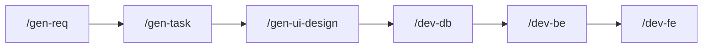

# WMS 교육 프로젝트 — Cursor 워크플로우

Cursor **Commands**(`/.cursor/commands/*.md`)만 순서대로 실행하면 요구사항 → Task → UI 설계 → DB → 백엔드 → 프론트엔드까지 이어갈 수 있습니다. 

## 기술 스택 (요약)

| 구분 | 스택 |
|------|------|
| 백엔드 | Java 17, Spring Boot 3.5.4, MyBatis 3.x, `Map<String, Object>` (DTO/VO 없음) |
| 보안 | Spring Security + JWT |
| DB | PostgreSQL, 스키마 `wms`, 테이블 접두 `twms_` |
| 프론트 | Vue 3(CDN), Element Plus, Tailwind, Axios — `frontend/` |
| 실행 | Backend: `./gradlew bootRun` / Frontend: Live Server 등 `http://localhost:3000` |

자세한 규칙은 **`.cursor/rules/project.common.mdc`** 및 하위 규칙 파일을 참고합니다.

## 전체 워크플로우



- **`/gen-req`**: (선택) RFP·요구사항 정의서 정리  
- **`/gen-task`**: Task 정의서  
- **`/gen-ui-design`**: UI HTML + Mock JSON  
- **`/dev-db`**: DDL·쿼리 (`database/` 등) — **BE 전에 두는 것을 권장**  
- **`/dev-be`**: Mapper XML → Service → Controller  
- **`/dev-fe`**: 페이지·Composable·**API 연동** (Mock → 실제 엔드포인트)

통합 검증은 전용 Command가 없습니다. 필요 시 채팅으로 요청하거나 `/dev-fe` 단계에서 연동을 마칩니다.

---

## 단계별 실행 가이드

각 단계는 Cursor 채팅에서 **슬래시 커맨드**를 입력하고, 해당 `.md`에 적힌 **입력·산출물**을 맞춥니다.

| 순서 | Command | 주요 입력 | 주요 산출물 |
|------|---------|-----------|-------------|
| 1 | `/gen-req` | `docs/01.analysis/01.rfp/*_prd.md` 등 | 요구사항 정의서 |
| 2 | `/gen-task` | 요구사항·기능 범위 | `docs/02.design/01.tasks/*.task.md` |
| 3 | `/gen-ui-design` | Task 파일 | `docs/02.design/02.ui/**` HTML, `common/api/v1/*.json` Mock |
| 4 | `/dev-db` | 엔티티·필드 | `database/schemas/`·`database/scripts/` (Command에 따라 `database/ddl/` 신규 생성 가능) |
| 5 | `/dev-be` | Task, API 표, 테이블명 | `backend/src/main/java/com/execnt/**`, `mapper/*.xml` |
| 6 | `/dev-fe` | Task, UI HTML, Mock | `frontend/views/**`, `composables/**` 등 |

### API 응답 규약

- 형식: `{ "result_code", "result_message", "data" }`  
- 성공: `result_code`가 `I`로 시작  
- 실패: `result_code`가 `E`로 시작  
- `success` 필드는 사용하지 않습니다.

### Rules 빠른 링크

| 용도 | 파일 |
|------|------|
| 공통·Skills 라우팅 | `.cursor/rules/project.common.mdc` |
| 백엔드 | `.cursor/rules/backend.dev.mdc`, `backend.db.naming.mdc`, `backend.db.sql-pattern.mdc`, `postgresql.mdc` |
| 프론트 | `.cursor/rules/frontend.dev.mdc`, `frontend.ui-design.mdc`, `frontend.component.mdc` |
| DB 명명 표준 | `.cursor/rules/db.naming-standard.mdc` |

UI 설계 시 추가로 **`.cursor/commands/gen-ui-design.md`** 절차를 따릅니다.

---

## 프로젝트·패키지 구조 (현행)

### 저장소 최상위

```
skax-devlab-wms/
├── .cursor/
│   ├── commands/          # 슬래시 커맨드 6종
│   ├── rules/             # *.mdc
│   ├── skills/            # SKILL.md
│   └── GUIDE.md
├── backend/               # Gradle (`group`: com.carfix)
├── frontend/              # Vue 3 CDN
├── database/
│   ├── schemas/           # 번호 순 공식 DDL·함수·권한 등
│   ├── scripts/           # 보조 DDL·시드·쉘
│   └── docs/guides/       # DB 설계·운영 가이드
└── docs/
    ├── 01.analysis/
    └── 02.design/
        ├── 01.tasks/
        └── 02.ui/         # 에픽별 HTML, common/api/v1 Mock JSON
```

### 백엔드 Java (`com.execnt`)

Gradle **아티팩트 그룹**은 `com.carfix`이고, **소스 루트 패키지**는 `com.execnt`입니다.

```
com.execnt
├── WmsApplication.java
├── auth
│   ├── filter      # JwtAuthenticationFilter
│   └── util          # JwtUtil
├── config            # SecurityConfig, SwaggerConfig, MessageSourceConfig
├── common
│   ├── controller    # HealthController, DbHealthController
│   ├── exception     # BizException, GlobalExceptionHandler
│   ├── openapi       # OpenApiExamples (Swagger 예시)
│   └── utils         # ResponseUtil
└── wms
    ├── controller    # REST API (인증·배치·이력·화면접속 등)
    ├── service
    └── mapper          # MyBatis Mapper 인터페이스
```

**리소스** (`backend/src/main/resources/`)

| 경로 | 용도 |
|------|------|
| `application.yml` | JDBC, MyBatis, JWT 등 설정 |
| `mapper/*.xml` | MyBatis SQL (인터페이스 네임스페이스와 동일 계층명 권장) |
| `messages/messages.properties` | 메시지 소스 |

### 프론트엔드 (`frontend/`)

| 경로 | 용도 |
|------|------|
| `index.html`, `app.js`, `router.js`, `sidebar.js`, `store.js`, `api.js` | 앱 진입·라우팅·상태·API 베이스 |
| `composables/` | `useApi`, `useAuth`, `useLogs` 등 |
| `components/layout/` | `AppLayout`, `SidebarMenu` |
| `views/Home.js`, `views/auth/Login.js` | 홈·로그인 |
| `views/logs/pages/` | 목록·등록·수정 페이지 (`List`, `Create`, `Edit`) |
| `views/logs/components/` | `LogsTable`, `LogsForm`, `LogsDialog` |

신규 화면은 보통 `views/{도메인}/pages/`·`components/`를 추가하고 `router.js`·`sidebar.js`에 등록합니다.

---

## 로컬 실행

**Backend**

```bash
cd backend
./gradlew bootRun
```

**Frontend**: VS Code Live Server 등으로 `frontend/index.html` 제공 (포트는 팀 기준, 예: 3000).

**DB**: `backend/src/main/resources/application.yml`의 JDBC URL·계정을 환경에 맞게 수정합니다. 스키마는 `database/schemas/README.md` 순서를 참고해 적용합니다.

---

## Command 원문

- [gen-req](.cursor/commands/gen-req.md) · [gen-task](.cursor/commands/gen-task.md) · [gen-ui-design](.cursor/commands/gen-ui-design.md)  
- [dev-db](.cursor/commands/dev-db.md) · [dev-be](.cursor/commands/dev-be.md) · [dev-fe](.cursor/commands/dev-fe.md)

**갱신**: 2026-03-25
