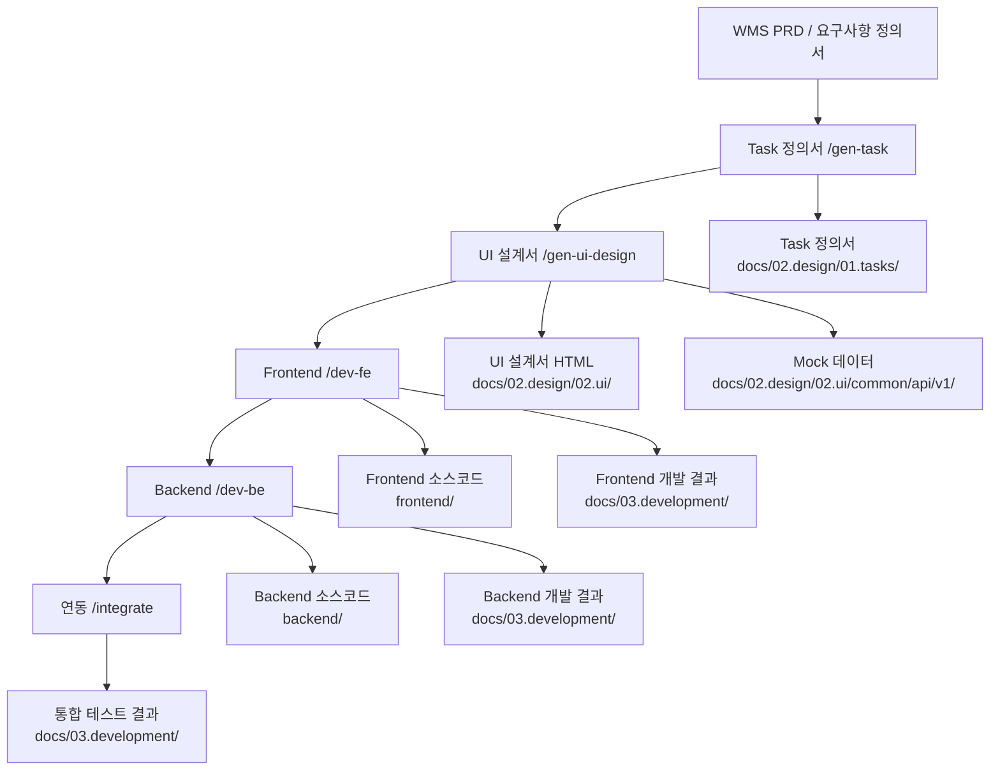

# AI 기반 자동 개발 워크플로우 - WMS (창고관리시스템)

## 개요

이 프로젝트는 Cursor **Commands**(`.cursor/commands/*.md`)를 순차적으로 사용하여 요구사항 정의서부터 설계 문서, 그리고 Frontend/Backend 소스코드까지 자동으로 생성하는 체계적인 개발 프로세스를 제공합니다. **`.cursor/prompts/*.md`는 삭제 대상이며 문서·워크플로우에서 참조하지 않는다.**

**대상 시스템**: WMS (창고관리시스템) - 입출고, 재고 관리, 배치 처리 등

## 전체 워크플로우



## 기술 스택 요약

| 구분 | 기술 | 비고 |
|------|------|------|
| **백엔드** | Java 17, Spring (레거시 구조) | PRD 섹션 10 |
| **데이터 접근** | MyBatis 3.x | Map<String, Object> 사용 |
| **인증** | 세션 기반 인증 | JWT 미사용 (PRD 섹션 12.1) |
| **프론트엔드** | Nexacro 기반 화면 | PRD 섹션 6.1, 9.1 |
| **DBMS** | PostgreSQL 17.x | 원본 MSSQL에서 전환 |
| **패키지** | `com.execnt` | PRD 섹션 10.2 |
| **스키마** | `wms` | 입출고/재고/마스터/배치 |
| **데이터 처리** | 저장 프로시저 (PostgreSQL Function) | PRD 섹션 7.1 |
| **API 구조** | Non-REST (Nexacro 연동) | REST API 미사용 (PRD 섹션 10.3) |

## Cursor 커맨드 사용 가이드

### 1단계: Task 정의서 작성

**Cursor 커맨드**: `/gen-task` (`.cursor/commands/gen-task.md`)  
**선행(선택)**: 요구사항 정형화는 `/gen-req` (`.cursor/commands/gen-req.md`)

**입력**:
- WMS PRD / 요구사항 정의서 (`docs/01.analysis/01.rfp/wms_prd.md`)
- 기존 Task 정의서 (파일명 순번 채번용)

**출력**:
- Task 정의서: `docs/02.design/01.tasks/wms-{{3digitSeqNum}}.{{1depthMenuName}}-{{2depthMenuName}}.task.md`

**주요 산출물**:
- 사용자 스토리 및 기능 명세
- 기술 요구사항 (시스템 아키텍처, 데이터 모델, API 설계)
- 비즈니스 규칙
- 개발 계획 (프론트엔드/백엔드 단계별 계획)

**참조 Rules**:
- `.cursor/.rules/project.common.instructions.mdc` - 프로젝트 공통 지침
- `.cursor/.rules/backend.dev.instructions.mdc` - 백엔드 개발 지침
- `.cursor/.rules/postgresql-standard-rule.mdc` - Database 및 Mapper 개발 지침

**DB 스키마 참조**:
- **스키마 구조 파악**: `database/schemas/*.sql` 파일 중 스키마 생성 관련 파일(`02_create_schema.sql` 등)을 참조하여 데이터베이스 스키마 생성 및 구조 파악
- **권한 구조 파악**: `database/schemas/01_create_roles_and_users.sql`, `13_grant_permissions.sql` 등을 참조하여 역할(Role), 사용자(User), 권한 부여 구조 파악
- **테이블 구조 및 관계 파악**: `database/schemas/03_~09_create_tables_*.sql` 파일을 참조하여 테이블 구조와 관계 파악
- **Function 구조 파악**: `database/schemas/10_~12_create_functions_*.sql` 파일을 참조하여 비즈니스 로직 Function 파악

---

### 2단계: UI 설계서 작성

**Cursor 커맨드**: `/gen-ui-design` (`.cursor/commands/gen-ui-design.md`)

**입력**:
- Task 정의서 (`docs/02.design/01.tasks/wms-XXX.task.md`)
- 기존 UI 설계서 (일관성 유지용)

**출력**:
- UI 설계서 HTML: `docs/02.design/02.ui/{{fileName}}/[파일명].html`
- Mock 데이터: `docs/02.design/02.ui/common/api/v1/[resource].json`

**주요 산출물**:
- UI 설계서 HTML 파일 (좌측 UI 영역 + 우측 명세 영역)
- Mock 데이터 JSON 파일 (Backend API 응답 형식과 동일)

**참조**:
- `.cursor/commands/gen-ui-design.md` — UI 설계서 작성 절차(좌측 UI + 우측 명세, Mock JSON)
- `.cursor/rules/frontend.ui-design.mdc` — UI/UX 디자인 시스템
- `.cursor/rules/frontend.dev.mdc` — 프론트엔드 스택·API 관례
- `.cursor/rules/frontend.component.mdc` — Vue·Element Plus 컴포넌트 규칙

**DB 스키마 참조** (선택): Mock만으로 설계할 때는 생략 가능. 테이블 정합성이 필요하면 `database/schemas/*.sql` 등을 참조한다.

---

### 3단계: Frontend 개발

**Cursor 커맨드**: `/dev-fe` (`.cursor/commands/dev-fe.md`)

**입력**:
- Task 정의서 (`docs/02.design/01.tasks/wms-XXX.task.md`)
- UI 설계서 HTML (`docs/02.design/02.ui/{{fileName}}/[파일명].html`)

**출력**:
- Frontend 소스코드: `frontend/`
- Frontend 개발 결과 문서: `docs/03.development/[UI설계서폴더명].frontend.dev-result.md`

**주요 산출물**:
- Nexacro 기반 화면 애플리케이션
- Task 정의서 기반 화면 구성
- Mock 데이터를 사용한 화면 개발 (Backend API 연동 준비)

**참조 Rules**:
- `.cursor/.rules/frontend.dev.instructions.mdc` - 아키텍처, 기술 스택, 디렉토리 구조
- `.cursor/.rules/frontend.uiux.instructions.mdc` - 디자인 시스템

**API 응답 형식**:
- Backend API 응답은 `{result_code, result_message, data}` 형식만 사용합니다.
- `success` 필드는 없습니다.
- 성공 여부 확인: `result_code`가 "I"로 시작하면 성공
- 에러 확인: `result_code`가 "E"로 시작하면 에러

---

### 4단계: Backend 개발

**Cursor 커맨드**: `/dev-be` (`.cursor/commands/dev-be.md`)

**입력**:
- Task 정의서 (`docs/02.design/01.tasks/wms-XXX.task.md`)
- Frontend 개발 결과 문서 (`docs/03.development/[UI설계서폴더명].frontend.dev-result.md`)
- UI 설계서 HTML (API 명세 확인용)

**출력**:
- Backend 소스코드: `backend/src/main/java/com/execnt/`
  - `wms/controller/` - 컨트롤러
  - `wms/service/` - 비즈니스 로직
  - `wms/mapper/` - MyBatis Mapper Interface
- Mapper XML: `backend/src/main/resources/mappers/[domain]/`
- Backend 개발 결과 문서: `docs/03.development/[UI설계서폴더명].backend.dev-result.md`

**주요 산출물**:
- Spring 기반 Controller → Service → Mapper 구조
- MyBatis를 사용한 데이터 접근 계층
- PostgreSQL Function 호출을 통한 상태 변경 처리
- 세션 기반 인증 (JWT 미사용)
- JUnit5 단위 테스트

**참조 Rules**:
- `.cursor/.rules/backend.dev.instructions.mdc` - 아키텍처, 기술 스택, 패키지 구조, 개발 규칙, 코드 스타일, JavaDoc 주석 규칙
- `.cursor/.rules/backend.db.standard.instructions.mdc` - DBMS 제품 독립 표준 SQL 및 MyBatis 개발 규칙
- `.cursor/.rules/postgresql-standard-rule.mdc` - PostgreSQL 특화 SQL 작성 규칙

**커맨드 실행 전 필수 절차**:
`/dev-be` 실행 전 반드시 다음 프로젝트 설정 정보를 사용자에게 질의하여 확인해야 합니다:

1. **프로젝트명**: 프로젝트의 전체 이름 (예: "WMS 창고관리시스템")
2. **프로젝트 간단명**: 프로젝트의 간단한 이름 (예: "WMS")
3. **기본 패키지명**: Java 기본 패키지명 (예: `com.execnt`)
4. **데이터베이스 스키마명**: PostgreSQL 데이터베이스 스키마명 (예: `wms`)
5. **작성자명**: JavaDoc의 `@author` 태그에 사용할 작성자명 (예: "시스템")

**작업 단계**:
1. **프로젝트 설정 정보 질의** (필수): 사용자로부터 프로젝트 설정 정보 확인 및 변수 치환
2. **API 명세 분석**: Task 정의서와 Frontend 개발 결과에서 API 엔드포인트 및 데이터 구조 파악
3. **DB 스키마 확인/생성**: 기존 스키마 활용 또는 신규 테이블 설계 (신규시 사용자 승인 요청)
4. **Backend 소스코드 생성**: Controller → Service → Mapper (Interface + XML)
5. **테스트 실행**: JUnit5 단위 테스트
6. **검증 및 문서화**: Backend 개발 결과 문서(`backend.dev-result.md`) 작성
7. **Frontend-Backend 연동**: Frontend의 Mock 데이터를 실제 Backend API로 전환

**API 응답 형식**:
- 모든 API 응답은 `{result_code, result_message, data}` 형식만 사용합니다.
- `success` 필드는 사용하지 않습니다.
- 성공 응답: `result_code`가 "I"로 시작 (예: "I0001", "I0002")
- 에러 응답: `result_code`가 "E"로 시작 (예: "E1001", "E9999")
- `ResponseUtil.createSuccessResponse()` 또는 `ResponseUtil.createErrorResponse()` 사용

---

### 5단계: Frontend-Backend 연동

**Cursor 커맨드**: `/integrate` (`.cursor/commands/integrate.md`)

**입력**:
- Frontend 개발 결과 문서
- Backend 개발 결과 문서
- Frontend 소스코드

**출력**:
- 연동 결과 문서: `docs/03.development/[UI설계서폴더명].integration-result.md`
- Frontend 소스코드 수정 (Mock 데이터 제거, 실제 API 호출로 전환)

**주요 작업**:
- Frontend Mock 데이터 제거
- API 엔드포인트 매핑 테이블 작성
- 통합 테스트 수행 (인증, CRUD, 에러 처리)
- API 응답 형식 일치 확인 (`{result_code, result_message, data}` 형식)

---

## 디렉토리 구조

```
skax-devlab-carcenter-wms/
├── .cursor/
│   ├── commands/                   # Cursor 슬래시 커맨드 (진입점)
│   │   ├── gen-req.md
│   │   ├── gen-task.md
│   │   ├── gen-ui-design.md
│   │   ├── dev-fe.md
│   │   ├── dev-be.md
│   │   └── integrate.md
│   └── .rules/                     # 개발 지침 파일
│       ├── project.common.instructions.mdc
│       ├── backend.dev.instructions.mdc
│       ├── backend.db.standard.instructions.mdc
│       └── postgresql-standard-rule.mdc
├── docs/
│   ├── 01.analysis/
│   │   └── 01.rfp/
│   │       └── wms_prd.md          # WMS 기존 기능 개선 PRD
│   ├── 02.design/
│   │   ├── 01.tasks/               # Task 정의서
│   │   │   └── wms-XXX.task.md
│   │   └── 02.ui/                  # UI 설계서
│   │       ├── {{fileName}}/
│   │       │   └── [파일명].html
│   │       └── common/
│   │           └── api/v1/         # Mock 데이터
│   │               └── [resource].json
│   └── 03.development/             # 개발 결과 문서
│       ├── [폴더명].frontend.dev-result.md
│       ├── [폴더명].backend.dev-result.md
│       └── [폴더명].integration-result.md
├── backend/                        # Backend 소스코드
│   └── src/main/
│       ├── java/com/execnt/        # com.execnt 패키지
│       │   ├── adm/                # 관리 모듈
│       │   ├── session/            # 세션 관리
│       │   ├── wms/                # 창고 관리 (입출고, 재고)
│       │   ├── mdm/                # 마스터 관리
│       │   ├── oms/                # 주문 관리
│       │   ├── bms/                # 실적 관리
│       │   └── vms/                # 시각화 관리
│       └── resources/
│           └── mappers/
├── frontend/                       # Frontend 소스코드
└── database/
    ├── schemas/                    # DB 스키마 스크립트 (WMS)
    │   ├── 01_create_roles_and_users.sql
    │   ├── 02_create_schema.sql
    │   ├── 03~09_create_tables_*.sql
    │   ├── 10~12_create_functions_*.sql
    │   ├── 13_grant_permissions.sql
    │   ├── 14_insert_common_codes.sql
    │   └── 15_insert_sample_data.sql
    └── docs/guides/                # DB 가이드 문서
```

---

## Rules 파일 참조 가이드

### 프로젝트 공통 Rules

| 파일 | 용도 | 주요 내용 |
|------|------|----------|
| `.cursor/.rules/project.common.instructions.mdc` | 프로젝트 공통 지침 | 언어 설정, 도구 사용법, 서버 실행 방법 |

### Backend Rules

| 파일 | 용도 | 주요 내용 |
|------|------|----------|
| `.cursor/.rules/backend.dev.instructions.mdc` | 백엔드 개발 지침 | 아키텍처, 기술 스택, 패키지 구조(`com.execnt`), 세션 인증, 코드 스타일 |
| `.cursor/.rules/backend.db.standard.instructions.mdc` | DB 표준 규칙 | DBMS 제품 독립 표준 SQL 및 MyBatis 개발 규칙 |
| `.cursor/.rules/postgresql-standard-rule.mdc` | PostgreSQL 특화 규칙 | PostgreSQL 특화 SQL 작성 규칙, 명명 규칙, 인덱스 규칙 |

---

## 사용 방법

### 1. Task 정의서 작성

```bash
# Cursor에서 커맨드 실행
# 커맨드: /gen-task (.cursor/commands/gen-task.md)
# 입력: WMS PRD 첨부 (docs/01.analysis/01.rfp/wms_prd.md)
# 출력: docs/02.design/01.tasks/wms-XXX.task.md
```

**체크리스트**:
- [ ] 요구사항 정의서 첨부 확인
- [ ] 프로젝트 설정 정보 질의 완료 (시스템명, 시스템 전체명)
- [ ] Task 정의서 파일명 규칙 준수
- [ ] 모든 섹션 완성도 확인

### 2. UI 설계서 작성

```bash
# Cursor에서 커맨드 실행
# 커맨드: /gen-ui-design (.cursor/commands/gen-ui-design.md)
# 입력: Task 정의서 첨부
# 출력: docs/02.design/02.ui/{{fileName}}/[파일명].html
```

### 3. Frontend 개발

```bash
# Cursor에서 커맨드 실행
# 커맨드: /dev-fe (.cursor/commands/dev-fe.md)
# 입력: Task 정의서 + UI 설계서 HTML 첨부
# 출력: frontend/ 소스코드 + 개발 결과 문서
```

### 4. Backend 개발

```bash
# Cursor에서 커맨드 실행
# 커맨드: /dev-be (.cursor/commands/dev-be.md)
# 입력: Task 정의서 + Frontend 개발 결과 문서 첨부
# 출력: backend/ 소스코드 + 개발 결과 문서
```

**체크리스트**:
- [ ] **프로젝트 설정 정보 질의 완료** (프로젝트명: WMS, 패키지명: `com.execnt`, 스키마명: `wms`)
- [ ] API 명세 분석 완료
- [ ] DB 스키마 확인/생성 완료
- [ ] Backend 소스코드 생성 완료 (Controller, Service, Mapper)
- [ ] API 응답 형식 확인 (`{result_code, result_message, data}` 형식)
- [ ] 테스트 실행 완료

### 5. Frontend-Backend 연동

```bash
# Cursor에서 커맨드 실행
# 커맨드: /integrate (.cursor/commands/integrate.md)
# 입력: Frontend 개발 결과 문서 + Backend 개발 결과 문서
# 출력: 연동 결과 문서 + Frontend 소스코드 수정
```

---

## 주의사항

### 필수 준수 사항

1. **커맨드 순서 준수**: `/gen-task` → `/gen-ui-design` → `/dev-fe` → `/dev-be` → `/integrate` 순으로 실행
2. **입력 파일 확인**: 각 커맨드 실행 전 필수 입력 파일 첨부 확인
3. **Rules 파일 준수**: `.cursor/rules/*.mdc` 지침 준수
4. **사용자 확인**: 각 단계별 작업 계획은 사용자 확인 후 실행 (자동 실행 금지)
5. **프로젝트 설정 정보 질의**: `/dev-be` 실행 전 반드시 프로젝트 설정 정보 질의 완료
6. **`.cursor/prompts/*.md`**: 삭제 대상 — 링크·참조하지 않음

### API 응답 형식 통일

- **Backend**: 모든 API 응답은 `{result_code, result_message, data}` 형식만 사용
- **Frontend**: `result_code`가 "I"로 시작하면 성공으로 판단
- **`success` 필드 사용 금지**: Backend와 Frontend 모두 `success` 필드를 사용하지 않음

### WMS 도메인 규칙 (PRD 기반)

- **인증**: 세션 기반 인증 사용 (JWT 사용 금지)
- **패키지**: `com.execnt` 구조 유지 (PRD 섹션 10.2)
- **API**: REST API 구조 사용 금지 (PRD 섹션 10.3)
- **데이터 처리**: Map<String, Object> 중심 데이터 처리
- **상태 변경**: 저장 프로시저(PostgreSQL Function) 내에서 데이터 저장과 함께 처리 (PRD 섹션 7.1)
- **신규 패키지**: 최소화하고 기존 패키지 내 기능 확장 우선 고려

### 파일명 규칙

- **Task 정의서**: `wms-{{3digitSeqNum}}.{{1depthMenuName}}-{{2depthMenuName}}.task.md`
- **UI 설계서**: `docs/02.design/02.ui/{{fileName}}/[파일명].html`
- **개발 결과 문서**: `docs/03.development/[UI설계서폴더명].{frontend|backend|integration}.dev-result.md`

---

## 상세 문서

워크플로우 진입점은 **`.cursor/commands/*.md`** 를 참조한다. **`.cursor/prompts/*.md`는 삭제 대상이며 참조하지 않는다.**

- [요구사항 정의 `/gen-req`](.cursor/commands/gen-req.md)
- [Task 분해 `/gen-task`](.cursor/commands/gen-task.md)
- [UI 설계서 `/gen-ui-design`](.cursor/commands/gen-ui-design.md)
- [Frontend 개발 `/dev-fe`](.cursor/commands/dev-fe.md)
- [Backend 개발 `/dev-be`](.cursor/commands/dev-be.md)
- [FE–BE 연동 `/integrate`](.cursor/commands/integrate.md)

---

**마지막 업데이트**: 2026-02-24
