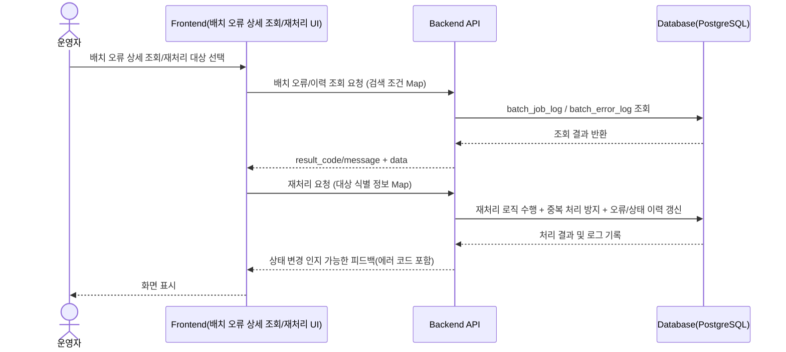
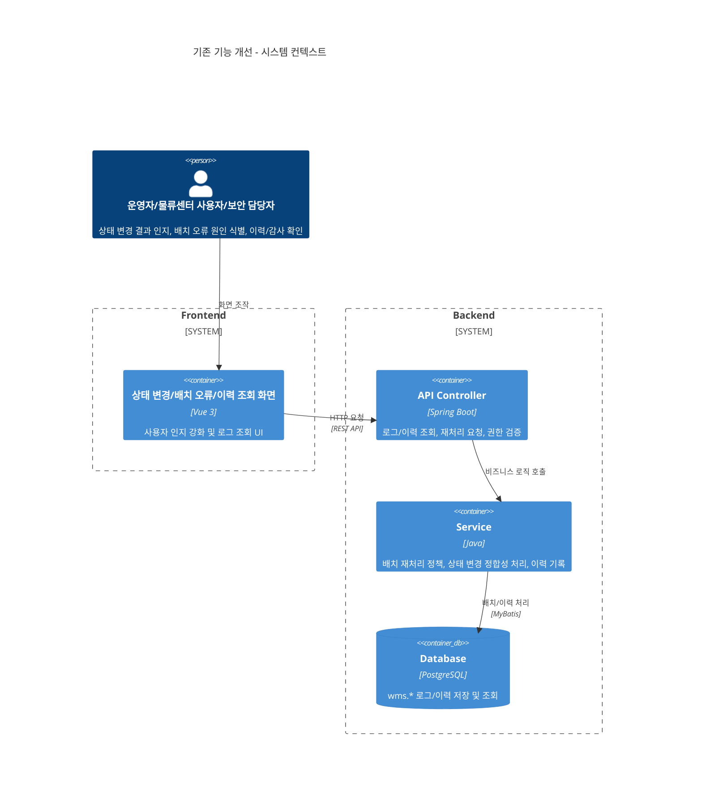
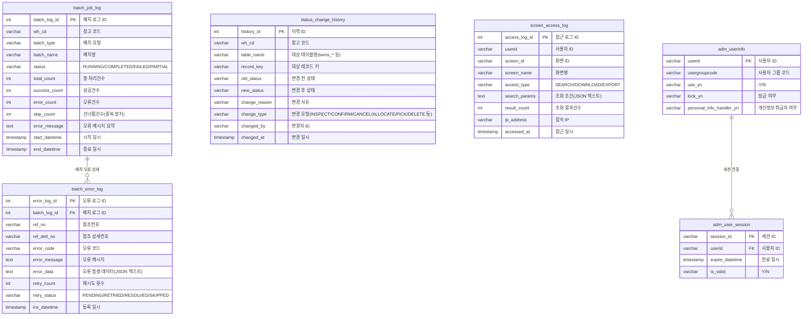

# 기존 기능 개선

**문서 버전**: v1.0
**생성일자**: 2026-03-25
**담당자**: WMS PL
**시스템**: WMS 창고관리시스템
**메뉴 경로**: 전체 > WMS > 기존 기능 개선

---
## 0. EPIC 하위 Task (문서 번호 = 수행 순서)

REQ 단위로 세부 Task 문서를 분리했으며, **파일명의 3자리 순번(002~006)이 권장 수행 순서**와 같다. **002(보안·권한)**에서 JWT·역할·API 인가 골격을 먼저 두고, **003(화면)** → **004(상태·정합성)** → **005(배치)** 순으로 업무 기능을 올린 뒤, **006(이력·로그)**는 정책(주요 단계·PII 화면 목록) 확정 후 고정 구현하면 된다.

| 순번 | 문서 | REQ ID | 요약 |
|:---:|:---|:---|:---|
| 002 | [wms-002.전체-WMS-보안-권한.task.md](./wms-002.전체-WMS-보안-권한.task.md) | REQ-WMS-IMPR-005 | 역할·권한·접근 통제(선행) |
| 003 | [wms-003.전체-WMS-화면인지-UX개선.task.md](./wms-003.전체-WMS-화면인지-UX개선.task.md) | REQ-WMS-IMPR-001 | 상태 변경 인지·입력 보완·즉시 피드백 |
| 004 | [wms-004.전체-WMS-상태변경-정합성.task.md](./wms-004.전체-WMS-상태변경-정합성.task.md) | REQ-WMS-IMPR-003 | 트랜잭션·정합성·오류 시 일관 처리 |
| 005 | [wms-005.전체-WMS-배치-주문생성개선.task.md](./wms-005.전체-WMS-배치-주문생성개선.task.md) | REQ-WMS-IMPR-002 | 배치 오류 식별·재처리 중복 최소화 |
| 006 | [wms-006.전체-WMS-이력-로그-감사.task.md](./wms-006.전체-WMS-이력-로그-감사.task.md) | REQ-WMS-IMPR-004 | 상태 이력(부분)·화면 접근 로그 |

> 본 문서(`wms-001`)는 Epic 전체 개요·공통 아키텍처·통합 API 초안을 담는다. 세부 구현 범위·파일 단위는 하위 문서를 우선한다.

## 1. 개요
### 1.1 목적
운영 중인 WMS의 안정적 운영을 위해 기존 기능을 개선·보완한다. 특히 고객 요청 반영, 오류·예외 상황 완화, 사용자 오입력·오동작 최소화, 상태 변경 및 처리 흐름의 가시성 확보, 유사 요청 대응력 강화를 목적으로 한다.

단, 핵심 업무 프로세스(입고 주문 생성 → 검수 → 입고 확정 → 재고 이동 → 출고 주문 생성 → 피킹 → 출고 확정)의 흐름 자체는 변경하지 않는다.

### 1.2 범위
**포함**
- 신규 화면 추가(일부), 기존 화면 일부 수정
- 입·출고 주문 생성 배치 로직 보완 및 안정성 강화
- 내부 처리 로직 및 인터페이스 개선(저장 프로시저 처리 흐름 정리, 상태 변경 로직 명확화 등)
- 화면 사용성 개선, 오류 가능성이 높은 입력 보완, 상태 변경 시 사용자 인지 강화
- 배치 예외 시 오류 원인 식별 개선, 재처리 시 중복 처리 가능성 최소화
- 이력·로그(부분 이력, 개인정보 화면 조회/다운로드 이력, 운영 대응 목적 추적) 관련 요구사항

**제외**
- 신규 업무 프로세스 추가
- 대규모 시스템 구조 변경

---
## 2. 사용자 스토리 및 기능 명세
### 2.1 요구사항
> 주요 요구사항 근거: `docs/01.analysis/02.requirements/wms-001.global-improvement.md`

```mermaid
requirementDiagram
    requirement "화면 인지 강화" {
        id: "REQ-WMS-IMPR-001"
        text: "상태 변경 관련 버튼/기능에 대한 사용자 인지를 강화하고, 오류 가능 입력을 보완하며 즉시 피드백을 제공한다."
        risk: medium
        verifymethod: test
    }

    requirement "입·출고 주문 생성 배치 보완" {
        id: "REQ-WMS-IMPR-002"
        text: "정기 배치 수행을 유지하며, 오류 원인 식별 가능성과 재처리 중복 가능성 최소화를 반영한다."
        risk: high
        verifymethod: analysis
    }

    requirement "상태 변경 및 데이터 정합성" {
        id: "REQ-WMS-IMPR-003"
        text: "상태 변경 중 오류 발생 시 데이터 불일치를 방지하고 정합성을 보장한다."
        risk: high
        verifymethod: test
    }

    requirement "이력·로그(부분 이력/추적, 개인정보)" {
        id: "REQ-WMS-IMPR-004"
        text: "모든 상태 변경 이력은 아니며, 일부 주요 단계와 개인정보 화면 접근(조회/다운로드) 이력에 대해 추적 가능해야 한다."
        risk: medium
        verifymethod: inspection
    }

    requirement "보안·권한" {
        id: "REQ-WMS-IMPR-005"
        text: "기존 권한 정책을 유지하며, 역할·권한에 따른 기능 노출/처리 제한을 반영한다."
        risk: high
        verifymethod: analysis
    }

    element "Frontend" {
        type: component
        docref: "frontend/views + 화면/컴포넌트 영역"
    }

    element "Backend API" {
        type: subsystem
        docref: "backend/*Controller, *Service, Map 기반 전달"
    }

    element "Database(PostgreSQL)" {
        type: system
        docref: "database/schemas (배치 로그/상태 이력/화면 접근 이력)"
    }

    "화면 인지 강화" - satisfies -> "Frontend"
    "입·출고 주문 생성 배치 보완" - satisfies -> "Backend API"
    "상태 변경 및 데이터 정합성" - satisfies -> "Backend API"
    "이력·로그(부분 이력/추적, 개인정보)" - satisfies -> "Database(PostgreSQL)"
    "보안·권한" - satisfies -> "Backend API"
```



### 2.2 관련 요구사항 (선택사항)
- `REQ-WMS-IMPR-001` : [화면 개선 및 사용자 인지](docs/01.analysis/02.requirements/wms-001.global-improvement.md)
- `REQ-WMS-IMPR-002` : [입·출고 주문 생성 배치](docs/01.analysis/02.requirements/wms-001.global-improvement.md)
- `REQ-WMS-IMPR-003` : [상태 변경 및 데이터 정합성](docs/01.analysis/02.requirements/wms-001.global-improvement.md)
- `REQ-WMS-IMPR-004` : [이력·로그(부분 이력/추적, 개인정보)](docs/01.analysis/02.requirements/wms-001.global-improvement.md)
- `REQ-WMS-IMPR-005` : [보안·권한](docs/01.analysis/02.requirements/wms-001.global-improvement.md)

### 2.3 사용자 스토리
**주요 사용자**
- 물류센터 사용자: 현장에서 상태 변경을 수행하며, 처리 결과와 다음 행동을 즉시 이해해야 한다.
- 운영자: 배치 오류 원인을 식별하고 재처리 시 중복 위험을 줄이며, 처리 흐름을 추적할 수 있어야 한다.
- 보안 담당자/IT 관리자: 개인정보 화면 접근(조회/다운로드)과 상태 변경 흐름을 감사 관점에서 추적해야 한다.

**스토리**
1. **상태 변경 인지**
   - As a 물류센터 사용자, I want to 상태 변경 결과/피드백을 명확히 확인하고, 오류 가능 입력을 사전에 보완받고 싶다, so that 오동작과 재작업을 줄일 수 있다.
2. **배치 오류 원인 식별**
   - As a 운영자, I want to 배치 실패/부분완료의 원인과 건별 사유를 확인하고 싶다, so that 재처리의 정확도를 높일 수 있다.
3. **재처리 중복 방지**
   - As a 운영자, I want to 재처리 시 중복 처리 위험을 최소화하고, 이미 처리된 건을 식별하고 싶다, so that 데이터 정합성을 보장할 수 있다.
4. **개인정보 화면 접근 감사**
   - As a 보안 담당자, I want to 개인정보 포함 화면의 조회/다운로드 이력을 조회/다운로드하고 싶다, so that 감사 및 운영 대응이 가능하다.

### 2.4 인수 조건
- [ ] 상태 변경 관련 화면에서 사용자가 수행 결과(성공/실패/거부 사유)를 즉시 확인할 수 있다.
- [ ] 배치 오류(실패/부분완료) 발생 시 건별 원인 식별 정보가 제공된다.
- [ ] 재처리 요청 시 중복 처리 위험을 최소화하고, 이미 처리된 건은 적절히 스킵/거부된다.
- [ ] 상태 변경 처리 오류 시 데이터 불일치가 발생하지 않으며, 일관된 오류 메시지/코드가 노출된다.
- [ ] 개인정보 화면 접근(조회/다운로드/내보내기)은 `wms.screen_access_log` 기준으로 추적 가능하다.
- [ ] 권한이 없는 사용자는 접근 통제 정책에 따라 기능 수행이 거부된다.

### 2.5 기능 워크플로우


---
## 3. 기술 요구사항
### 3.1 시스템 아키텍처


### 3.2 데이터 모델
> ERD는 `database/schemas`의 실제 테이블 기준으로 작성하며, 다이어그램 가독성을 위해 핵심 컬럼 위주로 표기한다.



### 3.3 API 설계
> 교육 프로젝트 기준: DTO/VO 사용 금지, 모든 계층 `Map<String, Object>` 기반 전달.
> Response Body: `{result_code, result_message, data}` 형식만 사용.

| Method | URL | Description | Request Body | Response Body |
|--------|-----|-------------|--------------|---------------|
| `GET` | `/api/batch-job-logs` | 배치 실행 이력 목록 조회 | - | Map (result_code, result_message, data) |
| `GET` | `/api/batch-job-logs/{batch_log_id}` | 배치 실행 이력 상세 조회 | - | Map (result_code, result_message, data) |
| `GET` | `/api/batch-job-logs/{batch_log_id}/errors` | 배치 오류 상세 목록 조회 | - | Map (result_code, result_message, data) |
| `GET` | `/api/status-change-histories` | 상태 변경 이력 조회 | - | Map (result_code, result_message, data) |
| `GET` | `/api/screen-access-logs` | 화면 조회/다운로드 이력 조회 | - | Map (result_code, result_message, data) |
| `POST` | `/api/batch-retry-requests` | 재처리 요청(중복 방지 정책 적용) | Map (검색/대상 식별 정보) | Map (result_code, result_message, data) |

> 주의: 기존 입·출고 상태 변경(검수/확정/취소/삭제) API의 엔드포인트 명세는 PRD/레거시 기반으로 이미 존재할 가능성이 높으므로, 본 문서에서는 “적용 대상/강화 포인트” 위주로 개발 Task를 정의한다.

### 3.4 비즈니스 규칙
#### 3.4.1 데이터 유효성 검증
- `batch_log_id`: 정수형이며 0보다 커야 한다.
- `ref_no`, `ref_detl_no`: 존재 여부/형식(길이) 검증이 필요하다.
- `screen_id`: 조회 요청에 사용되는 값은 공백 제거 및 길이 제한을 적용한다.
- 조회 조건(`search_params` 또는 검색 파라미터 JSON 텍스트)은 파싱 가능해야 한다.

#### 3.4.2 권한 및 보안
- 접근 권한은 기존 권한 정책을 따른다(물류센터 사용자/화주 사용자/센터 관리자/IT 관리자).
- 개인정보 포함 화면 접근 시, `wms.screen_access_log` 기록과 함께 권한이 없는 사용자의 접근은 차단한다.
- 인증 방식은 프로젝트 공통 지침(JWT 교육용 인증)을 따른다(세션 미사용).

#### 3.4.3 예외 처리 및 에러 핸들링
- 배치 처리 실패: `"배치 처리 중 오류가 발생했습니다. 건별 사유를 확인하세요."` (오류코드: E1001)
- 재처리 중복 위험: `"이미 처리된 건입니다. 재처리 조건을 확인하세요."` (오류코드: E1002)
- 허용되지 않는 상태 전환: `"현재 상태에서 수행할 수 없는 작업입니다."` (오류코드: E2001)
- 상태 변경 처리 중 오류: `"처리 중 오류가 발생했습니다. 데이터 정합성을 확인한 후 다시 시도하세요."` (오류코드: E2002)
- 입력값 오류: `"입력값을 확인하세요."` (오류코드: E3001)
- 권한 없음: `"권한이 없습니다."` (오류코드: E4001)

---
## 4. 개발 계획
### 4.1 전제조건
- 요구사항 및 데이터 모델(본 문서 §3.2)의 범위 확정
- “주요 단계” 이력 대상 및 “PII 화면 ID 목록”이 확정되어야 한다(현재 PRD에 미기재).
  - 확정 전까지는 이력/감사 설계를 **테이블 수준 완성**으로 고정하지 않는다.

### 4.2 개발 단계
#### Task 분해(초안)
| Task ID | 계층 | 난이도 | 설명 | 주요 근거 |
|---------|------|--------|------|----------|
| DB-001 | DB | Medium | 배치 로그/오류 로그 조회 기준(인덱스/검색 조건) 정리 | `08_create_tables_batch_log.sql` |
| DB-002 | DB | Medium | 상태 변경 이력 기록 키 설계(테이블명/레코드키/변경유형) 정리 | `09_create_tables_status_history.sql` |
| DB-003 | DB | Medium | 화면 조회/다운로드 이력 저장 필드 및 검색 파라미터 정책 정리 | `09_create_tables_status_history.sql` |
| BE-001 | BE | Hard | 배치 예외 시 건별 원인 식별 및 E1000~ 정책 반영 | `REQ-WMS-IMPR-002` |
| BE-002 | BE | Hard | 상태 변경 시 트랜잭션 정합성 + 이력 기록 일관성 보장 | `REQ-WMS-IMPR-003`, `REQ-WMS-IMPR-004` |
| BE-003 | BE | Medium | 배치/상태/화면 접근 로그 조회 API 구현(권한 포함) | `REQ-WMS-IMPR-004`, `REQ-WMS-IMPR-005` |
| BE-004 | BE | Hard | 재처리 요청 처리(중복 방지/스킵 정책 + 오류 코드) | `REQ-WMS-IMPR-002` |
| FE-001 | FE | Medium | 상태 변경 인지 강화 + 입력 보완(오동작 방지) | `REQ-WMS-IMPR-001` |
| FE-002 | FE | Hard | 배치 오류 상세/재처리 UI: 건별 사유 표시 + 재시도 위험 최소화 | `REQ-WMS-IMPR-002` |
| FE-003 | FE | Medium/Hard | 이력/로그 조회 UI: 개인정보 화면 접근 이력 포함(조회/다운로드) | `REQ-WMS-IMPR-004` |
| FE-004 | FE | Medium | 권한 위임/거부 시 UX 일관화(에러 코드 기반 메시지 표시) | `REQ-WMS-IMPR-005` |

#### Step 1: 프론트엔드 개발
> ⚠️ plan_task tool 사용 — 6단계 분할(본 문서는 코드 작성이 아닌 설계 기준만 정의)

**구현 내용**
- **[기능]** 상태 변경 사용자 인지 강화
  - 컴포넌트: `StatusChangeNotice*.js`(예: 변경 결과 배지/알림 컴포넌트)
  - 주요 메서드: `formatResultMessage()`, `validateInput()`
- **[기능]** 배치 오류 상세 조회/재처리 UI
  - 컴포넌트: `BatchErrorDetail*.js`, `BatchRetryRequest*.js`
  - 주요 메서드: `loadBatchErrorDetails()`, `submitRetryRequest()`
- **[기능]** 이력/로그 조회 UI(개인정보 화면 접근 이력 포함)
  - 컴포넌트: `HistoryLogList*.js`, `ScreenAccessLog*.js`
  - 주요 메서드: `searchLogs()`, `downloadLogData()`

**파일 구조(초안)**
```
frontend/
├── views/logs/
│   ├── BatchJobLogList.js
│   ├── BatchErrorDetail.js
│   ├── StatusChangeHistoryList.js
│   └── ScreenAccessLogList.js
├── components/custom/
└── api/v1/logs.json  # Mock 데이터(교육 단계)
```

#### Step 2: 백엔드 개발
> ⚠️ plan_task tool 사용 — 4단계 분할(본 문서는 설계/태스크 정의 중심)

**구현 내용**
- Controller: `[Resource]Controller.java`
  - `BatchJobLogController`, `BatchErrorLogController`, `StatusChangeHistoryController`, `ScreenAccessLogController`, `BatchRetryRequestController`(예시)
- Service: `[Resource]Service.java`
  - 배치 오류 원인 식별, 재처리 중복 방지, 상태 변경 정합성 보장, 이력 기록
- Mapper: `[Resource]Mapper.java` + `[Resource]Mapper.xml`
  - 조회/검색 쿼리, 조건 필터링, 인덱스 활용

> DTO/VO 사용 금지. `Map<String, Object>` 사용.

**개발 시 적용 포인트**
- 상태 변경 수행 로직 내 이력 기록이 “성공/실패” 경계에서 일관되게 수행되어야 한다.
- 권한 위임/거부는 서버에서 확정하며, FE는 에러 코드 기반으로 메시지를 통일한다.
- 재처리는 이미 처리된 건을 식별하여 스킵/거부할 수 있도록 한다(건별 단위 근거 확보).

### 4.3 테스트 전략
- 수동 테스트: 사용자 화면에서 배치 오류 상세/재처리/이력 조회 흐름 검증
- API 테스트: Swagger UI(`http://localhost:8080/swagger-ui.html`)에서 로그/이력 조회 엔드포인트 검증
- 회귀 테스트: 상태 변경 전후 데이터 정합성 및 이력 기록 유무/일치성 확인

---
## 5. 검증 체크리스트
### 5.1 Task 정의서 완성도
- [ ] 헤더: 버전/담당자/생성일자/메뉴 경로 완비
- [ ] 사용자 스토리: “As a... I want to... so that...” 형식 준수
- [ ] 인수 조건: 검증 가능한 조건 중심으로 작성
- [ ] 다이어그램: Requirement/Sequence/C4/ERD 포함 및 문법 오류 없음
- [ ] API 명세: 로그/이력/재처리 중심 엔드포인트가 정의되어 있음
- [ ] 개발 단계: 프론트엔드 → 백엔드 순으로 적용 기준을 명시

### 5.2 요구사항 반영 확인
- [ ] `REQ-WMS-IMPR-001`~`REQ-WMS-IMPR-005` 요구사항이 Task 분해에 반영됨
- [ ] 상태 전환/정합성 관련 예외 시나리오(E2001/E2002)가 누락되지 않음
- [ ] 배치 오류 식별 및 재처리 중복 방지(E1001/E1002)가 누락되지 않음
- [ ] 개인정보 화면 접근 로그(`wms.screen_access_log`) 기반 추적 요구가 반영됨

