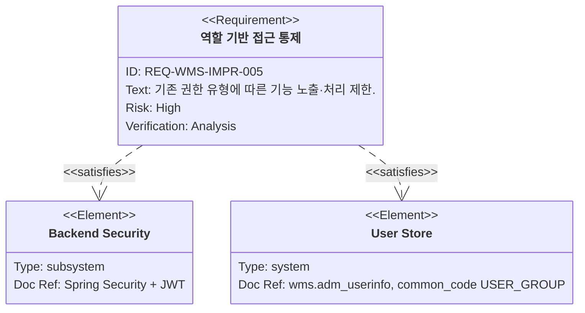
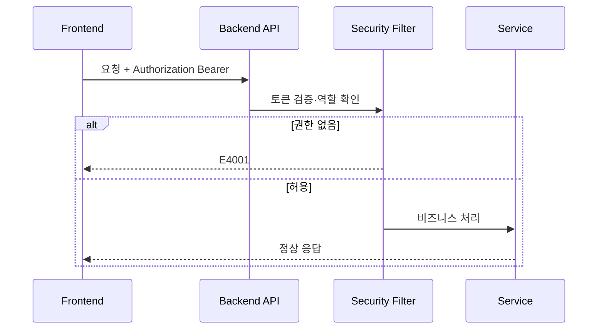
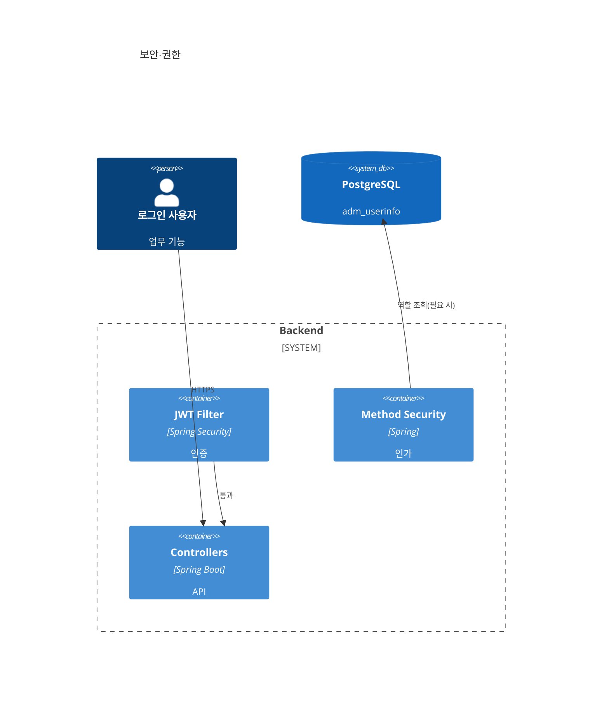
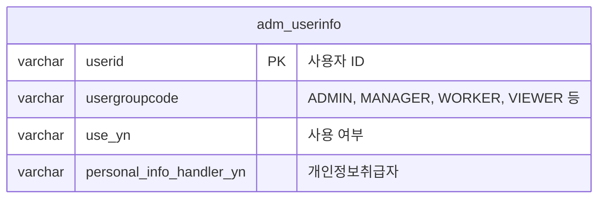

# 보안·권한

**문서 버전**: v1.0
**생성일자**: 2026-03-25
**담당자**: WMS PL
**시스템**: WMS 창고관리시스템
**메뉴 경로**: 전체 > WMS > 기존 기능 개선 > 보안·권한

**상위 Epic**: [wms-001.전체-WMS-기존기능개선.task.md](./wms-001.전체-WMS-기존기능개선.task.md)
**근거 REQ**: `REQ-WMS-IMPR-005` — `docs/01.analysis/02.requirements/wms-001.global-improvement.md`

---

## 1. 개요

### 1.1 목적

물류센터 사용자, 화주 사용자, 센터 관리자, IT 관리자 등 **기존 권한 정책**을 유지하면서, 역할·권한에 따른 기능 노출과 서버측 처리 제한을 일관되게 적용한다. 프로젝트 공통 지침에 따라 **JWT(교육용)** 를 사용하되, PRD의 접근 통제·감사 요구는 유지한다.

### 1.2 범위

**포함**

- API 단위 권한 검증(상태 변경, 배치 조회/재처리, 이력 조회)
- 프론트 메뉴·버튼 노출 정책(역할별)
- 권한 없음 응답 E4001

**제외**

- 상용 SSO·복잡한 ABAC(교육 범위 밖이면 명시적으로 제외)

---

## 2. 사용자 스토리 및 기능 명세

### 2.1 요구사항

### 2.2 사용자 스토리

- As a IT 관리자, I want to 민감 API에 일반 작업자가 접근하지 못하길 원한다, so that 데이터와 운영 안전이 지켜진다.

### 2.3 인수 조건

- [ ] 권한 없는 호출은 서버에서 거부되며 E4001이 반환된다.
- [ ] JWT 클레임(또는 서버 세션 조회)의 역할과 `usergroupcode` 매핑이 문서화된다.
- [ ] 배치 재처리·이력 조회 등 고위험 기능은 관리자 계열만 가능하다(정책 표로 정의).

### 2.4 기능 워크플로우

---

## 3. 기술 요구사항

### 3.1 시스템 아키텍처

### 3.2 데이터 모델

`database/schemas/04_create_tables_user.sql`, `14_insert_common_codes.sql`의 `USER_GROUP` 참고.

### 3.3 API 설계

모든 보호 API에 공통:

- 미인증 → 401(교육 프로젝트 표준에 맞게 `result_code`로 래핑 여부 결정)
- 인증되었으나 권한 없음 → E4001

역할별 허용 표(초안):

| 기능 영역 | WORKER | MANAGER | ADMIN | VIEWER |
|-----------|--------|---------|-------|--------|
| 입·출고 상태 변경 | O | O | O | X |
| 배치 로그 조회 | X | O | O | X |
| 배치 재처리 요청 | X | O | O | X |
| 이력·감사 로그 조회 | X | O | O | 조회만 |

> 실제 매핑은 구현 전 확정·개정 가능.

### 3.4 비즈니스 규칙

- 권한 없음 → `"권한이 없습니다."` (E4001)
- 계정 잠금·미사용 계정은 `adm_userinfo.lock_yn`, `use_yn`과 연계

---

## 4. 개발 계획

### 4.1 전제조건

- JWT 발급·검증 모듈(공통 모듈) 준비
- `usergroupcode` ↔ 역할 명칭 단일화

### 4.2 Task 분해

| Task ID | 계층 | 난이도 | 설명 |
|---------|------|--------|------|
| BE-SEC-001 | BE | Hard | URL·메서드 단위 Security 설정 + JWT 연동 |
| BE-SEC-002 | BE | Medium | 서비스 레벨 방어(이중 체크) |
| FE-SEC-001 | FE | Medium | 역할별 라우트 가드·버튼 `v-if` 정책 |
| DB-SEC-001 | DB | Easy | (선택) 읽기 전용 계정 분리는 인프라 정책에 따름 |

### 4.3 테스트 전략

- 역할별 API 호출 매트릭스(자동 또는 체크리스트)
- E4001 메시지·코드 UI 표시 확인([wms-003](./wms-003.전체-WMS-화면인지-UX개선.task.md)와 연계)

---

## 5. 검증 체크리스트

- [ ] REQ-WMS-IMPR-005 인수 조건 충족
- [ ] 고위험 API에 대해 VIEWER·WORKER 오남용 시나리오 차단
- [ ] Epic `wms-001` 오류 코드 표와 일치(E4001)
