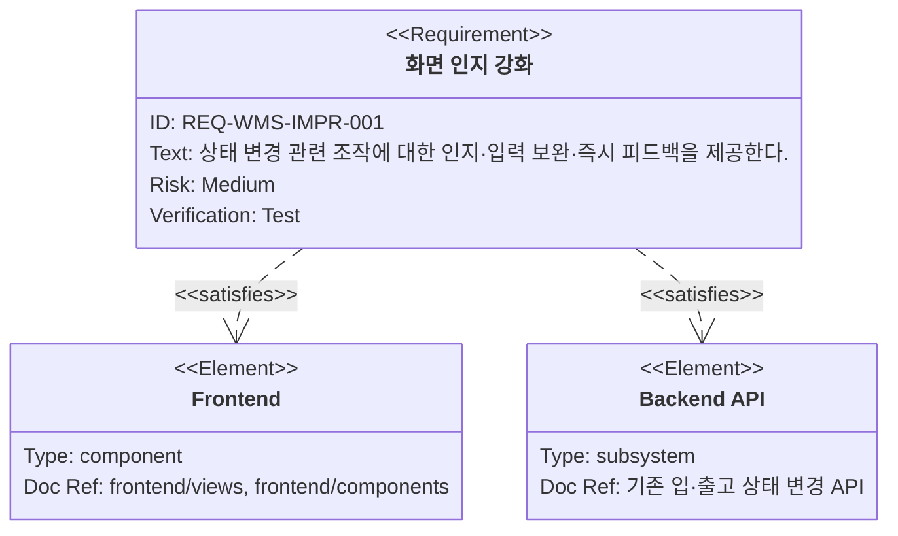
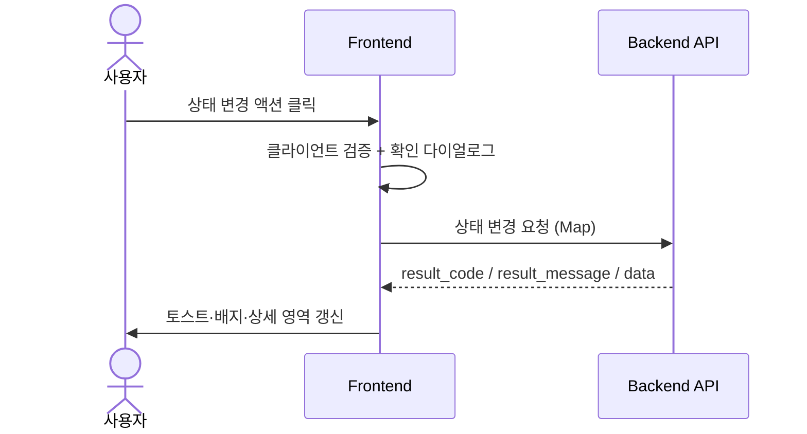
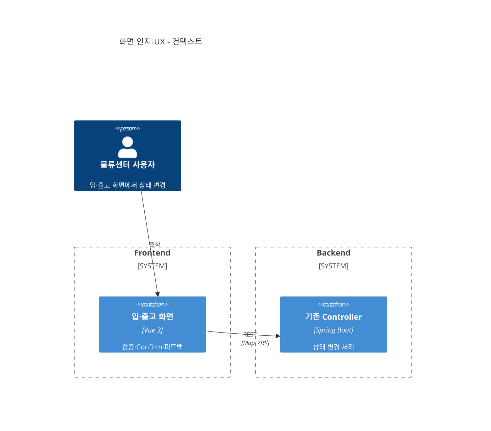
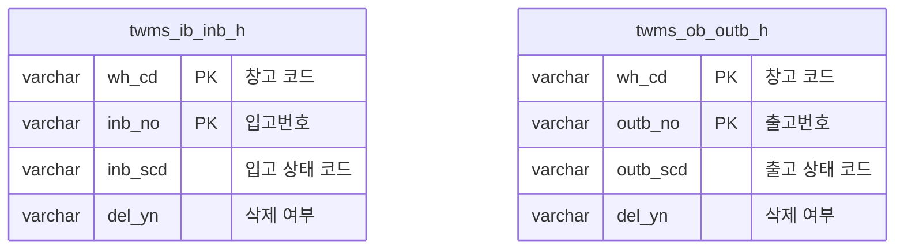

# 화면 인지 및 UX 개선

**문서 버전**: v1.0
**생성일자**: 2026-03-25
**담당자**: WMS PL
**시스템**: WMS 창고관리시스템
**메뉴 경로**: 전체 > WMS > 기존 기능 개선 > 화면 인지·UX

**상위 Epic**: [wms-001.전체-WMS-기존기능개선.task.md](./wms-001.전체-WMS-기존기능개선.task.md)
**근거 REQ**: `REQ-WMS-IMPR-001` — `docs/01.analysis/02.requirements/wms-001.global-improvement.md`

---

## 1. 개요

### 1.1 목적

상태 변경과 연관된 버튼·기능에 대해 사용자 인지를 강화하고, 오류 가능성이 높은 입력을 보완하며, 잘못된 조작 시 즉시 확인 가능한 피드백을 제공한다. 핵심 업무 프로세스(입고·출고 흐름)는 변경하지 않는다.

### 1.2 범위

**포함**

- 상태 변경 전 확인(Confirm)·결과 토스트/배지·로딩·비활성화 등 인지 UX
- 필수값·형식·선행 조건에 대한 클라이언트 검증 및 서버 메시지(`result_code`)와의 정렬
- 입·출고 화면 등 기존 화면의 부분 수정(신규 화면은 최소)

**제외**

- 업무 규칙 자체의 변경(허용 상태 전환 조건은 기존 정책 유지)
- 배치·이력 테이블 스키마 변경(별도 Task)

---

## 2. 사용자 스토리 및 기능 명세

### 2.1 요구사항

### 2.2 사용자 스토리

**주요 사용자**: 물류센터 사용자, 센터 관리자

1. **상태 변경 전 재확인**
   - As a 물류센터 사용자, I want to 위험한 작업 전에 명확한 확인을 받고 싶다, so that 실수로 상태를 바꾸지 않는다.
2. **결과 즉시 인지**
   - As a 물류센터 사용자, I want to 작업 성공·실패·거부 사유를 화면에서 바로 알고 싶다, so that 다음 조치를 잘못하지 않는다.

### 2.3 인수 조건

- [ ] 입고·출고 등 상태 변경 버튼은 위험도에 맞는 확인(Confirm) 또는 이중 동작이 적용된다.
- [ ] API 응답 `result_code`·`result_message`가 사용자에게 일관된 형태로 표시된다(예: E2001, E3001).
- [ ] 필수·형식 오류는 제출 전에 가능한 한 클라이언트에서 차단되고, 서버 검증과 메시지가 충돌하지 않는다.
- [ ] 처리 중에는 중복 클릭·중복 제출이 방지된다.

### 2.4 기능 워크플로우

---

## 3. 기술 요구사항

### 3.1 시스템 아키텍처

### 3.2 데이터 모델

화면은 주로 `wms.twms_ib_inb_h`(`inb_scd` 등), `wms.twms_ob_outb_h`(`outb_scd` 등)를 조회·갱신한다. 스키마 상세는 `database/schemas/05_create_tables_inbound.sql`, `06_create_tables_outbound.sql`을 따른다.

### 3.3 API 설계

> DTO/VO 금지, `Map<String, Object>`. Response: `{result_code, result_message, data}`.

실제 URL은 프로젝트 내 기존 입·출고 API에 맞춘다. 본 Task에서는 **응답·에러 코드 정렬**이 핵심이다.

| Method | URL | Description | Request Body | Response Body |
|--------|-----|-------------|--------------|----------------|
| `PUT` | `/api/inbound/orders/{inbNo}/status` | 입고 상태 변경(예시 경로) | Map | Map |
| `PUT` | `/api/outbound/orders/{outbNo}/status` | 출고 상태 변경(예시 경로) | Map | Map |

### 3.4 비즈니스 규칙

#### 3.4.1 데이터 유효성 검증

- 상태 변경 대상 키(`wh_cd`, `inb_no` / `outb_no`) 필수
- 서버가 거부한 경우(E2001 등) UI는 동일 문구로 표시

#### 3.4.2 예외 처리

- 허용되지 않는 상태 전환 → E2001
- 입력값 오류 → E3001

---

## 4. 개발 계획

### 4.1 전제조건

- 입·출고 화면 라우트·컴포넌트 구조 확정(또는 스캐폴딩)
- [wms-002](./wms-002.전체-WMS-보안-권한.task.md)과 에러 코드·권한 거부(E4001) 표시 정책 정렬

### 4.2 개발 단계

#### Task 분해

| Task ID | 계층 | 난이도 | 설명 |
|---------|------|--------|------|
| FE-UX-001 | FE | Medium | 상태 변경 Confirm·중복 클릭 방지·로딩 표시 |
| FE-UX-002 | FE | Medium | `result_code` 기반 메시지 매핑·토스트/배지 컴포넌트 |
| FE-UX-003 | FE | Easy | 폼 검증 규칙 정리(필수·길이·형식) |
| BE-UX-001 | BE | Medium | 거부·검증 응답의 `result_code`·메시지 일관성 점검(기존 API) |

#### Step 1: 프론트엔드

- 컴포넌트: `StatusActionBar.js`, `useStatusChangeConfirm.js`(Composable 예시)
- 적용 화면: `frontend/views/inbound/pages/*`, `frontend/views/outbound/pages/*`(경로는 구현 시 확정)

#### Step 2: 백엔드

- 기존 Controller/Service에서 E2001/E3001 반환 형식 통일 여부 점검(신규 엔드포인트가 없으면 수정 최소화)

### 4.3 테스트 전략

- 수동: 각 상태 변경 시나리오별 Confirm·토스트·에러 코드 표시
- API: Swagger로 거부 응답 코드 확인

---

## 5. 검증 체크리스트

- [ ] REQ-WMS-IMPR-001 인수 조건 충족
- [ ] Sequence·Requirement·C4·ERD Mermaid 문법 오류 없음
- [ ] Epic `wms-001`과 에러 코드·API 응답 규약 일치
