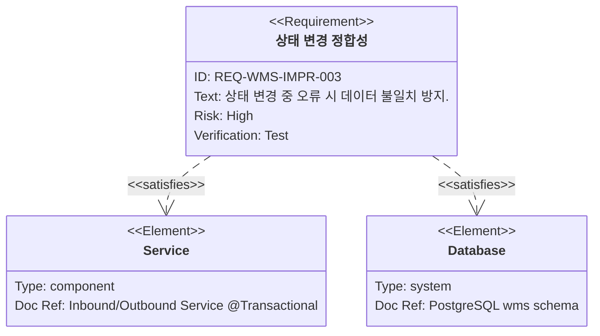
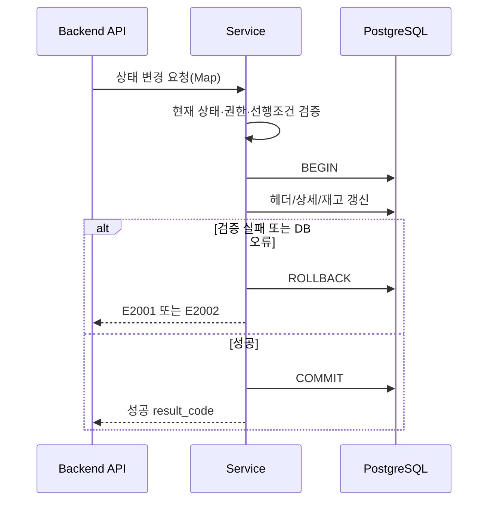
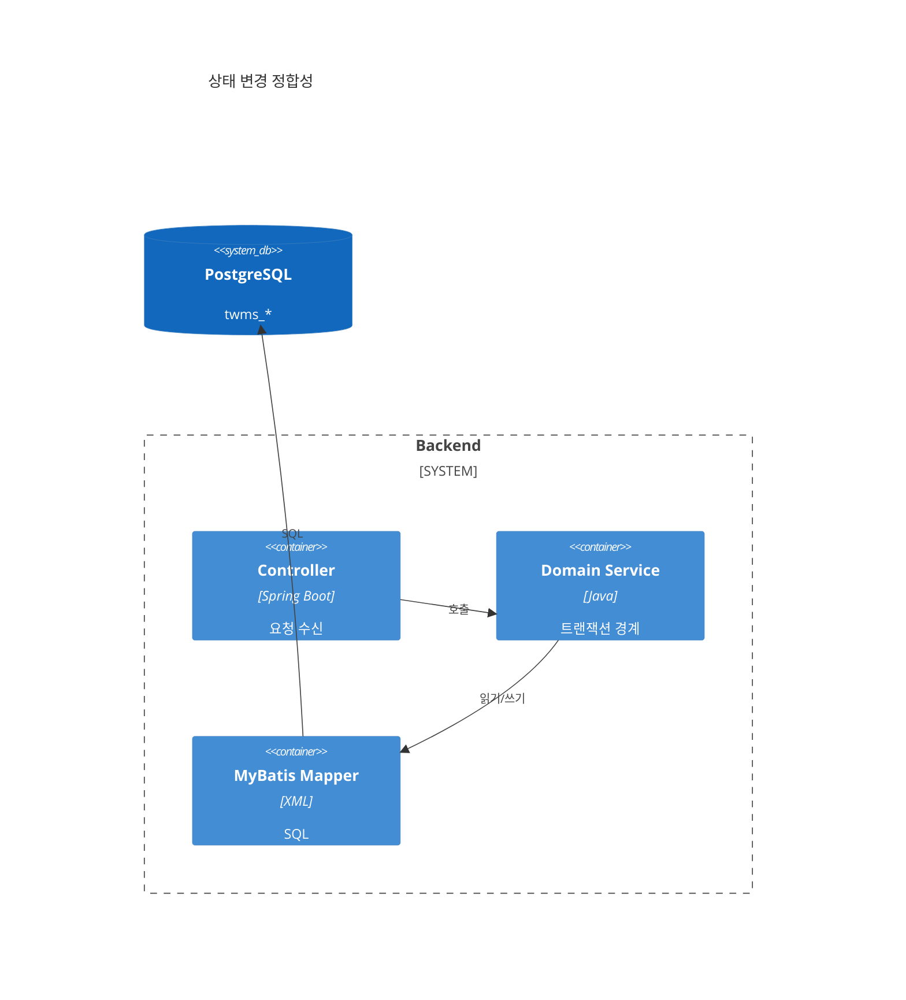
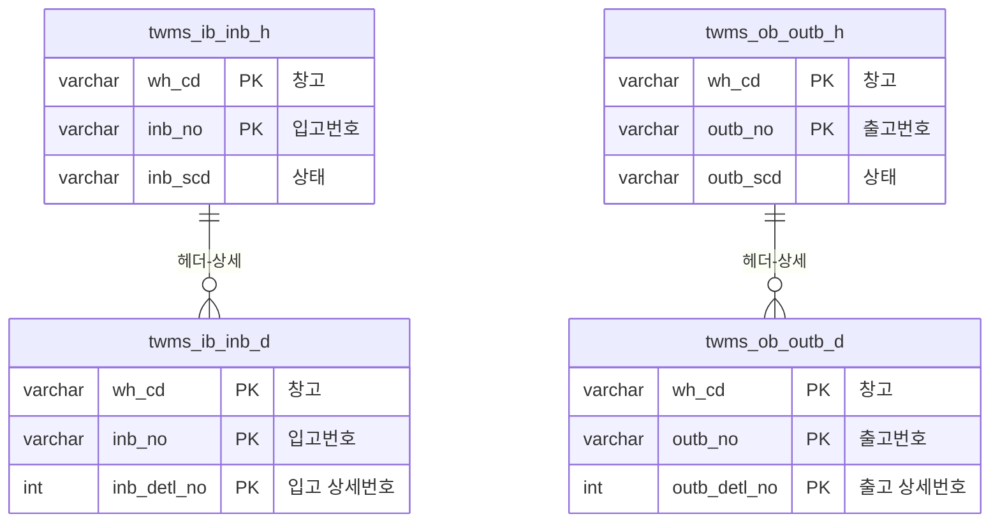

# 상태 변경 및 데이터 정합성

**문서 버전**: v1.0
**생성일자**: 2026-03-25
**담당자**: WMS PL
**시스템**: WMS 창고관리시스템
**메뉴 경로**: 전체 > WMS > 기존 기능 개선 > 상태 변경·정합성

**상위 Epic**: [wms-001.전체-WMS-기존기능개선.task.md](./wms-001.전체-WMS-기존기능개선.task.md)
**근거 REQ**: `REQ-WMS-IMPR-003` — `docs/01.analysis/02.requirements/wms-001.global-improvement.md`

---

## 1. 개요

### 1.1 목적

상태 변경 처리 중 오류가 발생해도 **데이터 불일치가 생기지 않도록** 트랜잭션과 업무 규칙을 정리한다. PRD 관점에서 상태 변경은 데이터 저장과 함께 수행되는 흐름을 유지한다.

### 1.2 범위

**포함**

- 입고(`twms_ib_inb_h`/`inb_scd`), 출고(`twms_ob_outb_h`/`outb_scd`) 상태 전환의 서버측 검증
- 단일 트랜잭션 내 헤더·상세·재고 연관 갱신 시 롤백 일관성
- 거부·실패 시 E2001/E2002 및 명확한 메시지

**제외**

- 새로운 상태 코드 체계 도입(기존 코드 체계 유지)

---

## 2. 사용자 스토리 및 기능 명세

### 2.1 요구사항

### 2.2 사용자 스토리

- As a 시스템, I want to 상태 변경이 전부 성공하거나 전부 롤백되길 원한다, so that 부분 갱신으로 인한 재고·주문 불일치를 막는다.

### 2.3 인수 조건

- [ ] 허용되지 않는 전환은 DB에 반영되지 않는다.
- [ ] 예외 발생 시 클라이언트는 E2002와 함께 일관된 안내를 받는다.
- [ ] 동시성(동일 주문 동시 처리) 시나리오에 대한 정책이 문서화된다(낙관적 락·DB 제약 등).

### 2.4 기능 워크플로우

---

## 3. 기술 요구사항

### 3.1 시스템 아키텍처

### 3.2 데이터 모델

### 3.3 API 설계

기존 입·출고 상태 변경 API에 `@Transactional` 범위·예외 매핑을 명확히 한다.

| Method | URL | Description | Request Body | Response Body |
|--------|-----|-------------|--------------|----------------|
| `PUT` | `/api/inbound/orders/{inbNo}/status` | 입고 상태 변경(예시) | Map | Map |
| `PUT` | `/api/outbound/orders/{outbNo}/status` | 출고 상태 변경(예시) | Map | Map |

### 3.4 비즈니스 규칙

- 허용되지 않는 상태 전환 → E2001
- 처리 중 오류·롤백 → E2002

---

## 4. 개발 계획

### 4.1 전제조건

- 입·출고별 허용 전환표(상태 다이어그램)를 코드 또는 설정으로 단일화
- [wms-006](./wms-006.전체-WMS-이력-로그-감사.task.md)에서 “주요 단계” 이력과 충돌하지 않는지 확인

### 4.2 Task 분해

| Task ID | 계층 | 난이도 | 설명 |
|---------|------|--------|------|
| BE-ST-001 | BE | Hard | 상태 전이 검증 모듈(단일 진입점) |
| BE-ST-002 | BE | Hard | 서비스 메서드 트랜잭션 경계·예외 처리 정리 |
| BE-ST-003 | BE | Medium | 동시성 전략(버전 컬럼 또는 DB 락) 결정 및 적용 |
| DB-ST-001 | DB | Medium | 필요 시 제약·인덱스로 역행 방지 보강(운영 DDL 정책 준수) |

### 4.3 테스트 전략

- 통합 테스트: 정상 전환·거부·DB 예외 시 롤백
- 동시 요청 스트레스(교육 범위 내)

---

## 5. 검증 체크리스트

- [ ] REQ-WMS-IMPR-003 인수 조건 충족
- [ ] E2001/E2002 시나리오별 재현·문서화
- [ ] Epic `wms-001` 시퀀스 다이어그램과 모순 없음
