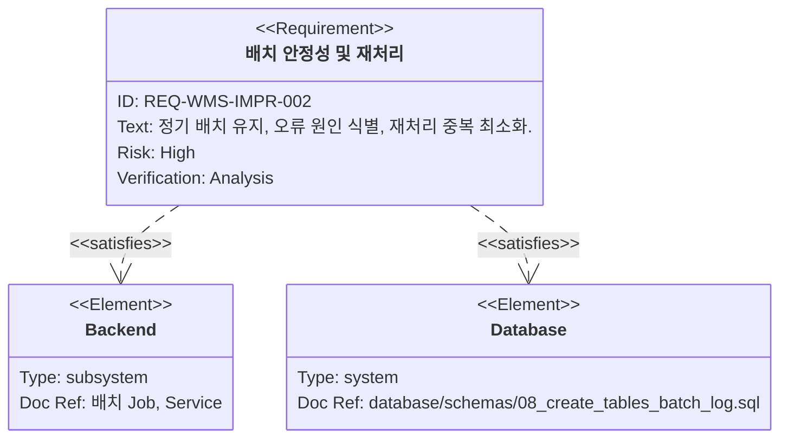
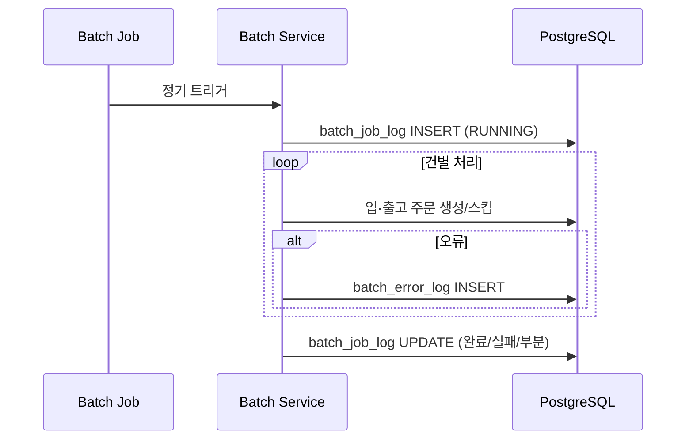
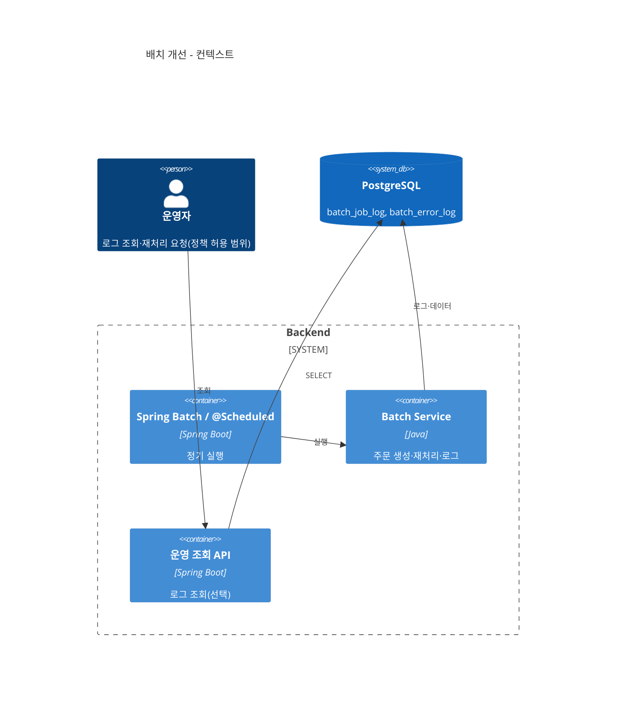
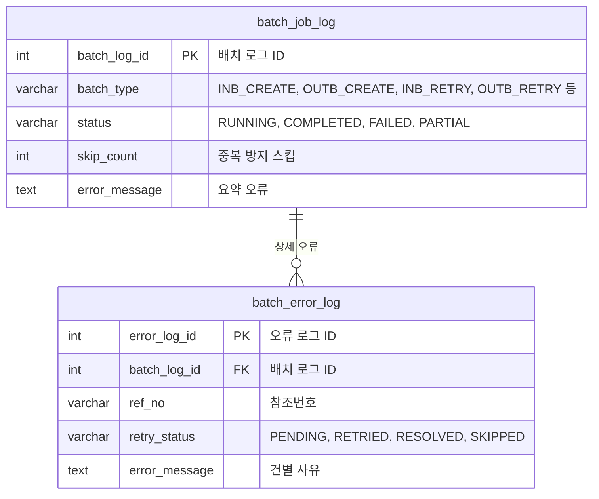

# 입·출고 주문 생성 배치 개선

**문서 버전**: v1.0
**생성일자**: 2026-03-25
**담당자**: WMS PL
**시스템**: WMS 창고관리시스템
**메뉴 경로**: 전체 > WMS > 기존 기능 개선 > 배치

**상위 Epic**: [wms-001.전체-WMS-기존기능개선.task.md](./wms-001.전체-WMS-기존기능개선.task.md)
**근거 REQ**: `REQ-WMS-IMPR-002` — `docs/01.analysis/02.requirements/wms-001.global-improvement.md`

---

## 1. 개요

### 1.1 목적

입·출고 주문 생성을 **정기 배치**로 유지하면서, 오류 발생 시 **건별 원인 식별**을 강화하고, 재처리 시 **중복 처리 가능성**을 최소화한다. 운영 환경에서 수동 배치 실행은 제공하지 않는다는 요구를 전제로 하되, 로컬 테스트 예외는 PRD·요구사항 문서의 서술을 따른다.

### 1.2 범위

**포함**

- `wms.batch_job_log`, `wms.batch_error_log` 활용한 실행·오류 추적 강화
- 재처리 흐름 유지 + 중복 방지(`skip_count`, `retry_status` 등) 정책 명확화
- 운영자·개발자가 원인 파악 가능한 로그/메시지(E1001, E1002)

**제외**

- 배치 스케줄러 제품 도입·인프라 전면 교체
- 연계 채널(파일/API/DB)의 구체 규격 정의(요구사항상 미정 시 스텁 유지)

---

## 2. 사용자 스토리 및 기능 명세

### 2.1 요구사항

### 2.2 사용자 스토리

1. **오류 원인 파악**
   - As a 운영자, I want to 배치 실행 단위와 실패 건별 사유를 조회하고 싶다, so that 재처리 범위를 정확히 정한다.
2. **중복 재처리 방지**
   - As a 운영자, I want to 이미 처리된 건이 재처리에서 스킵되거나 명확히 거부되길 원한다, so that 데이터가 꼬이지 않는다.

### 2.3 인수 조건

- [ ] 배치 1회 실행이 `batch_job_log`에 누적되고 상태(`RUNNING`/`COMPLETED`/`FAILED`/`PARTIAL`)가 기록된다.
- [ ] 실패 건은 `batch_error_log`에 `ref_no` 등 식별자와 함께 남는다.
- [ ] 재처리 시 E1002 조건에 해당하면 사용자에게 명확히 안내된다.
- [ ] PRD상 운영에서 수동 배치 미제공 요구와 충돌하지 않는다(로컬 예외는 코드/설정으로 구분).

### 2.4 기능 워크플로우

---

## 3. 기술 요구사항

### 3.1 시스템 아키텍처

### 3.2 데이터 모델

근거: `database/schemas/08_create_tables_batch_log.sql`, 공통 코드 `BATCH_TYPE`, `BATCH_STATUS` — `14_insert_common_codes.sql`.

### 3.3 API 설계

> DTO/VO 금지, `Map<String, Object>`.

| Method | URL | Description | Request Body | Response Body |
|--------|-----|-------------|--------------|----------------|
| `GET` | `/api/batch-job-logs` | 배치 실행 이력 목록 | - | Map |
| `GET` | `/api/batch-job-logs/{batch_log_id}` | 실행 이력 상세 | - | Map |
| `GET` | `/api/batch-job-logs/{batch_log_id}/errors` | 오류 상세 목록 | - | Map |
| `POST` | `/api/batch-retry-requests` | 재처리(중복 방지 정책) | Map | Map |

운영에서 수동 실행 API를 두지 않는 경우, 위 조회·재처리 API는 **내부망·관리자 전용** 또는 **로컬 프로파일 전용**으로 제한한다.

### 3.4 비즈니스 규칙

- 배치 처리 실패 안내 → E1001
- 재처리 중복 위험 → E1002
- `ref_no`·`batch_log_id` 등 식별자는 응답·로그에 포함해 추적 가능하게 한다.

---

## 4. 개발 계획

### 4.1 전제조건

- 배치 실행 진입점(`@Scheduled` 등)과 트랜잭션 경계 확정
- [wms-004](./wms-004.전체-WMS-상태변경-정합성.task.md)와 주문 생성 후 상태 정합성 규칙 충돌 여부 검토

### 4.2 Task 분해

| Task ID | 계층 | 난이도 | 설명 |
|---------|------|--------|------|
| DB-BT-001 | DB | Easy | 배치 로그 조회용 필터 컬럼·인덱스 활용 점검 |
| BE-BT-001 | BE | Hard | 배치 루프 내 try/catch + `batch_error_log` 적재 일관화 |
| BE-BT-002 | BE | Hard | 재처리 시 idempotent 키(`ref_no` 등) 기반 스킵/거부 |
| BE-BT-003 | BE | Medium | 로그 조회·재처리 API + 권한([wms-002](./wms-002.전체-WMS-보안-권한.task.md)) |
| FE-BT-001 | FE | Medium | 배치 이력·오류 상세 화면(운영 정책 허용 시) |

### 4.3 테스트 전략

- 단위: 재처리 중복 시나리오(동일 `ref_no` 두 번)
- 통합: 배치 1회 실행 후 로그 건수·상태 전이
- API: Swagger로 목록/상세 조회

---

## 5. 검증 체크리스트

- [ ] REQ-WMS-IMPR-002 인수 조건 충족
- [ ] E1001/E1002가 로그·API 응답에 반영
- [ ] Mermaid 다이어그램 렌더링 가능
- [ ] Epic `wms-001` §3.2 배치 테이블 정의와 모순 없음
