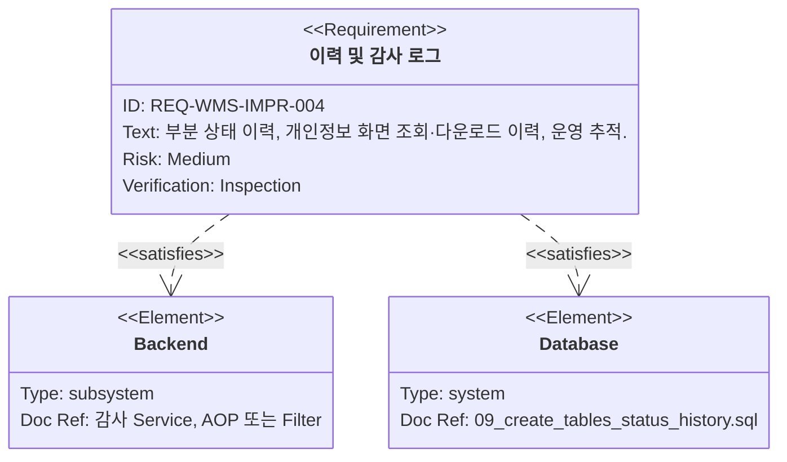
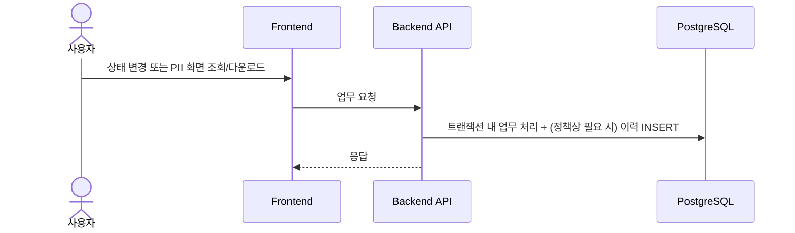
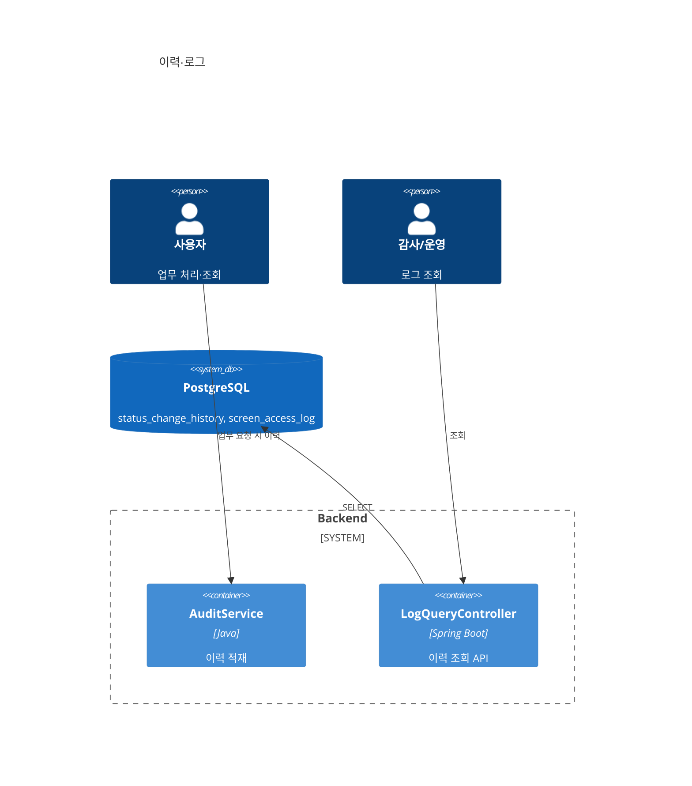
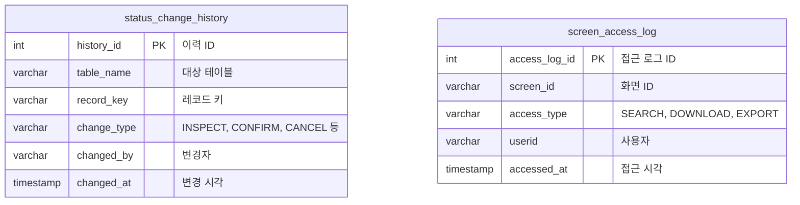

# 이력·로그(부분 이력·화면 접근 감사)

**문서 버전**: v1.0
**생성일자**: 2026-03-25
**담당자**: WMS PL
**시스템**: WMS 창고관리시스템
**메뉴 경로**: 전체 > WMS > 기존 기능 개선 > 이력·로그

**상위 Epic**: [wms-001.전체-WMS-기존기능개선.task.md](./wms-001.전체-WMS-기존기능개선.task.md)
**근거 REQ**: `REQ-WMS-IMPR-004` — `docs/01.analysis/02.requirements/wms-001.global-improvement.md`

---

## 1. 개요

### 1.1 목적

모든 상태 변경을 이력 테이블에 남기지는 않되, **일부 주요 단계**에 대해서는 추적 가능하도록 한다. **개인정보 포함 화면**에 대해서는 조회·다운로드(및보내기) 이력을 남겨 감사·운영 대응에 활용한다.

### 1.2 범위

**포함**

- `wms.status_change_history`에 대한 기록·조회 설계(대상 단계 확정 후)
- `wms.screen_access_log`에 대한 기록·조회(`ACCESS_TYPE`: `SEARCH`, `DOWNLOAD`, `EXPORT` — `14_insert_common_codes.sql`)

**제외(전제)**

- “주요 단계” 목록·PII 화면 ID 목록이 **요구사항 보완 문서로 확정되기 전**에는 구현 범위를 테이블·화면 단위로 고정하지 않는다. 본 Task는 **확정 후 착수** 또는 **플래그·설정 기반으로 확장 가능한 골격**만 제공한다.

---

## 2. 사용자 스토리 및 기능 명세

### 2.1 요구사항

### 2.2 사용자 스토리

1. **운영 추적**
   - As a 운영자, I want to 특정 주문의 상태 변경 이력을 시간순으로 보고 싶다, so that 고객 문의에 대응한다.
2. **개인정보 접근 감사**
   - As a 보안 담당자, I want to 누가 어떤 화면을 조회·다운로드했는지 확인하고 싶다, so that 정책 위반을 추적한다.

### 2.3 인수 조건

- [ ] 확정된 “주요 단계”에 한해 `status_change_history`에 기록된다.
- [ ] 확정된 PII 화면에서 검색·다운로드·보내기 시 `screen_access_log`에 남는다.
- [ ] 로그 조회 API는 권한이 있는 역할만 접근 가능하다([wms-002](./wms-002.전체-WMS-보안-권한.task.md)).

### 2.4 기능 워크플로우

---

## 3. 기술 요구사항

### 3.1 시스템 아키텍처

### 3.2 데이터 모델

근거: `database/schemas/09_create_tables_status_history.sql`

### 3.3 API 설계

> DTO/VO 금지, `Map<String, Object>`.

| Method | URL | Description | Request Body | Response Body |
|--------|-----|-------------|--------------|----------------|
| `GET` | `/api/status-change-histories` | 상태 변경 이력 검색 | - | Map |
| `GET` | `/api/screen-access-logs` | 화면 접근 이력 검색 | - | Map |
| `POST` | `/api/screen-access-logs` | 클라이언트 비콘 기록(선택) | Map | Map |

### 3.4 비즈니스 규칙

- 이력 대상 단계·PII 화면 목록은 **요구사항 보완 문서**로 확정 후 코드/설정에 반영
- 개인정보 로그에는 불필요한 민감값 전문 저장 지양(JSON `search_params` 설계 시 마스킹)

---

## 4. 개발 계획

### 4.1 전제조건

- `docs/01.analysis/02.requirements/`에 **주요 단계 목록**·**PII 화면 ID 목록** 보완 문서 작성(또는 기존 문서 개정)
- [wms-004](./wms-004.전체-WMS-상태변경-정합성.task.md)와 이력 기록 시점(커밋 전/후) 합의

### 4.2 Task 분해

| Task ID | 계층 | 난이도 | 설명 |
|---------|------|--------|------|
| BE-LG-001 | BE | Medium | 상태 변경 성공 시 `status_change_history` 적재 훅(정책 테이블 기준) |
| BE-LG-002 | BE | Medium | PII 화면 목록 기반 `screen_access_log` 적재(Filter/AOP/프론트 비콘 중 선택) |
| BE-LG-003 | BE | Easy | 이력 조회 API + 검색 조건(Map) |
| FE-LG-001 | FE | Medium | 이력 조회 화면(관리자) |
| DB-LG-001 | DB | Easy | 조회 성능용 인덱스 활용 점검(신규 DDL은 운영 정책에 따름) |

### 4.3 테스트 전략

- 정책에 포함된 화면/단계만 로그가 쌓이는지 회귀 테스트
- 비포함 화면에서는 로그가 과다 적재되지 않는지 확인

---

## 5. 검증 체크리스트

- [ ] REQ-WMS-IMPR-004 인수 조건 충족
- [ ] 주요 단계·PII 목록 확정 전/후 범위가 문서에 명시됨
- [ ] Epic `wms-001`과 API·테이블 정의 일치
